# EnglishPaperWrittenCommonMistakes

***
 from The Most Common Habits from more than 200 English Papers written by Graduate Chinese Engineering Students
***

## 1.main difficult

 a.not enough focused on writing,let alone technical writing

 b.never lived in an English speaking country

 c.need a technical writing course

## 2.structure

### section 1: bad habits

#### Articles

+ Articles written by Chinese students are often characterized by the following bad habits:
  + The, a, and an are
    + 1) omitted where they are required,
    + 2) used where they are not needed or contribute to wordiness
    + 3) used wrongly in place of the correct article.

+ Examples
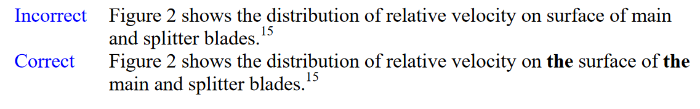
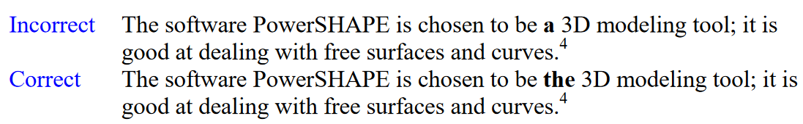
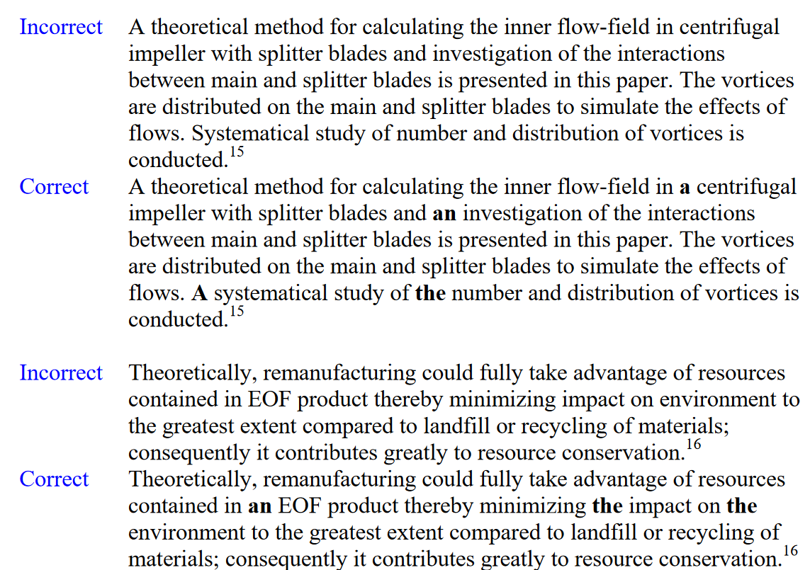

+ Correct usage of articles
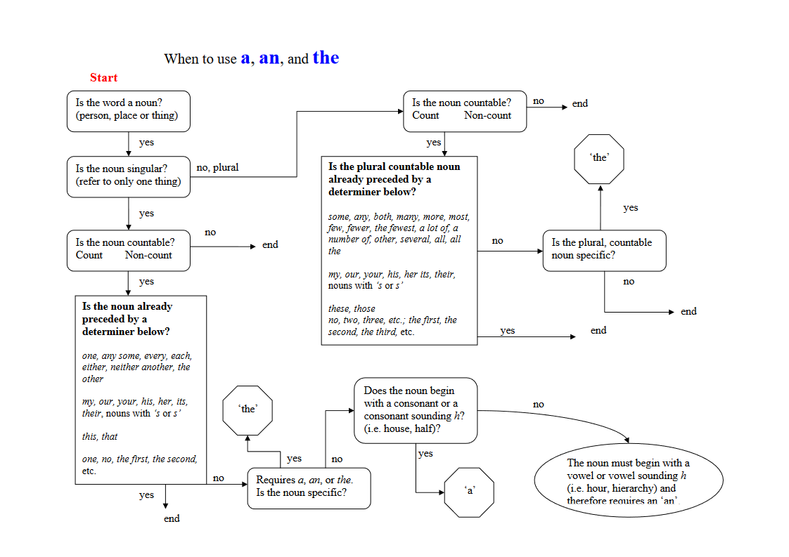
  + Nonspecific noun :
    + A noun that refers to any of a number of identical items; it takes the indefinite articles a , an.
  + Specific noun :
    + A noun understood to be exactly and specifically referred to; uses the definite article the.

#### very long sentences

+ in English, the main idea and each supporting idea is typically written in separate sentences.
+ Long sentences can be avoided by limiting each sentence to one or two topics.

  + Examples
  1)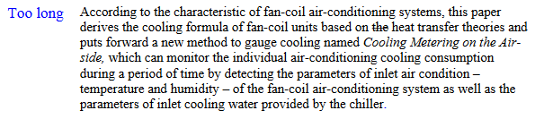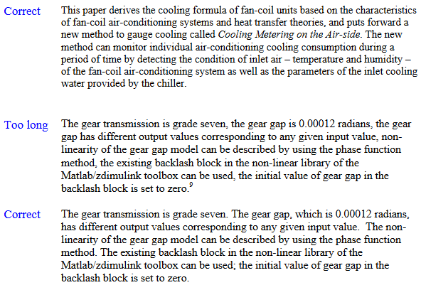
  + of a list
  2)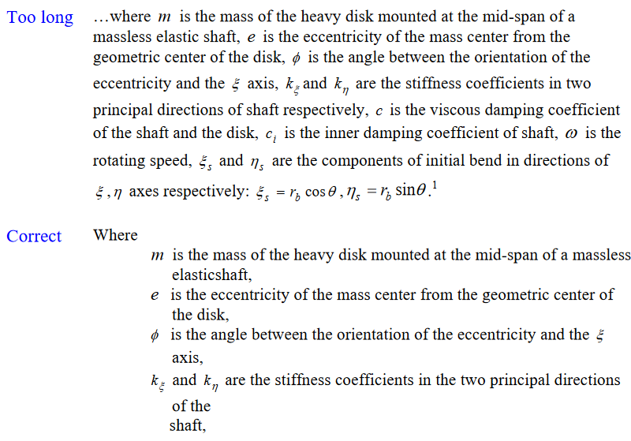
  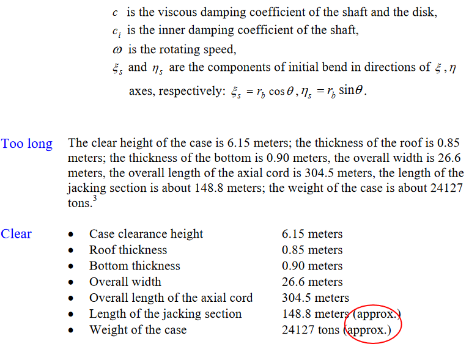

#### Bring the main diea to the back

+ this has the effect of demoting the importance of the main idea and making the reader think the author is indirect.

+ Examples
  + 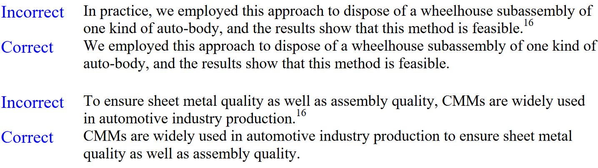

#### Tendency of placing phrases at the begin a sentence

+ The modification of a sentence should be placed behind the main idea of the sentence.
+ Examples
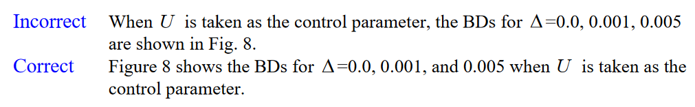

+ Place the most important subject at the beginning of the sentence for emphasis

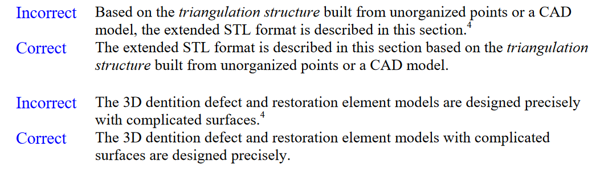

#### 'which/ that' && 'Respectively' and 'respective' && 'In this paper' and 'in this study' && Numbers and Equations && 'such as' and 'etc.'

+ 'which/ that'
  + ‘The Shijiazhuang south road underground bridge possesses the largest jacking force, **which** is built at 1978(10680t).’
  + ‘Shijiazhuang south road underground bridge possesses the largest jacking force **which** is built at 1978(10680t).’

+ 'Respectively' and 'respective'
  + Respectively: refers back to two or more persons or things **only in the order** they were previously designated or mentioned.
  + mistake 1 :misplaced
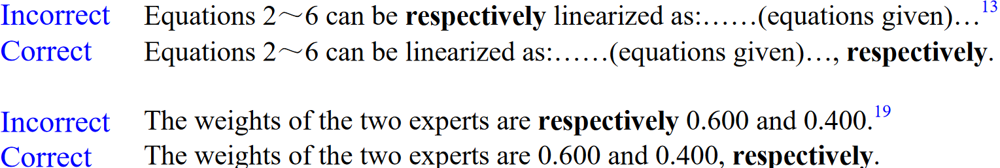
  + mistake 2 :redundancy
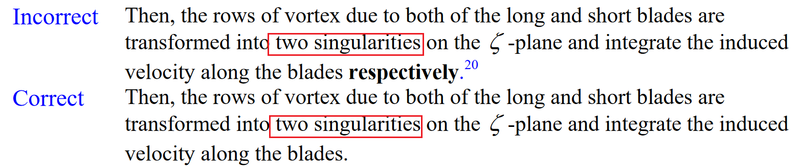
  + mistake 3 :ambiguous
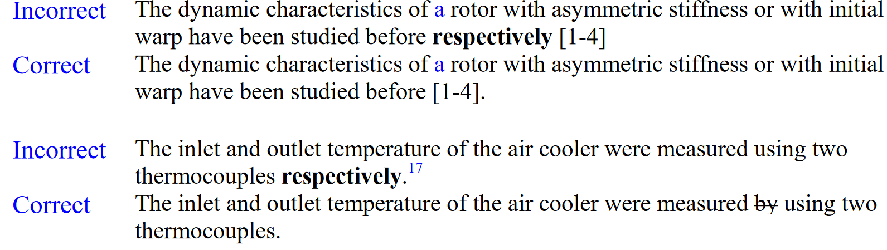

+ 'In this paper' and 'in this study'
  + mistake 1 :abuse
  + written by native English writersthese phrases are reserved for primarily *two uses*
    + 1. In the introduction and conclusion to emphasize the content of the paper.
    + 2. In the body of the paper, after referring to work not done by the author such as in other journal articles or in standard.
  + mistake 2 :interchanged
    + in this paper -> The paper is the mode to present this work and is what the reader is holding/ reading
    + in the study -> The study is  the work the author/s did
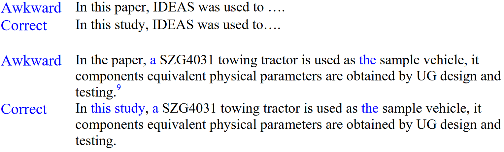

+ Numbers and Equations
  + Arabic numerals should never be used at the beginning of sentences.

  + Arabic numerals should be used to give data in technical papers

  + Equations should be introduced as much as possible, not inserted in place of words.

+ 'such as' and 'etc.'
  + ***etc.*** means ‘and so on’ and is used at the end of a list to show it is not complete.
  + ***such as*** means ‘for example’ and implies that an incomplete list will follow

  + ***Such as*** means that an **incomplete list** will be given and should **not** be used when a **complete list** is given.
  + Examples
  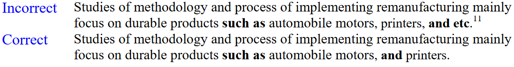
  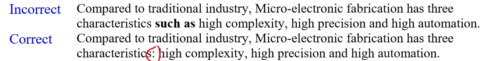
  
### section 2: small nuances

1) not need an ***s*** added on to make them plural
   + literature (when referring to research)
   + equipment,
   + staff (referring to a group of people)
   + faculty

2) ==Avoid redundancy==
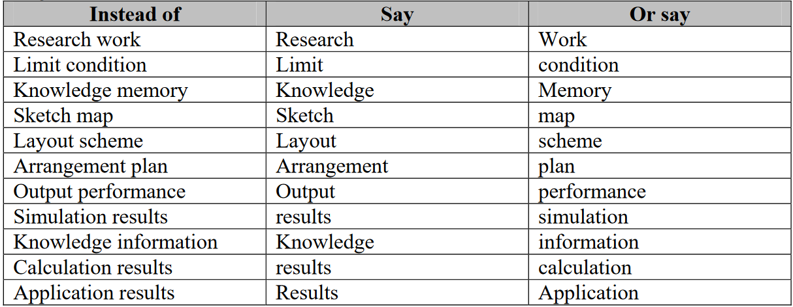

3) some words modify is plural
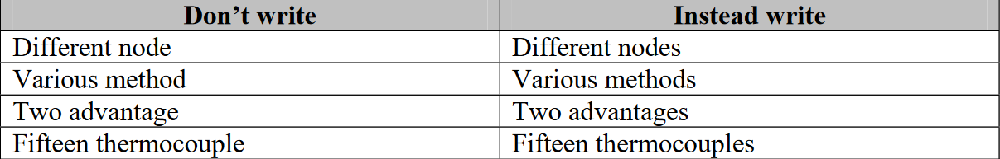

4) Never begin an English sentence with abbreviations and Arabic numerals

5) Do not write  ***‘by this way’*** . Instead write  ***‘by doing this’*** , or ***‘using this method***

6) Never write ***‘How to...’*** at the beginning of a sentence. (Don’t say it ither.)
   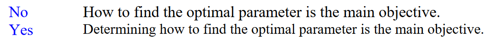

7) Do write ‘the results are ***shown in*** Figure 2’. Do not write ‘the results are ***showed as*** Figure 2’.

8) *Italicize* variables appearing in the text to differentiate them from words.This is especially important when the variables are English alphabets.

   + Write ‘The graph shows *t*, *a*, and *C* as a function of time’. Do not write ‘The graph shows t, a, and C as a function of time’.

9) NO ***Obviously***
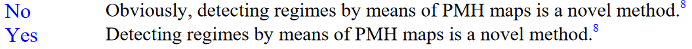

10) International papers should ==not== use location dependant terms such as ***‘at home’, ‘abroad’, ‘here’,*** ***‘our country’*** because the reader most likely is not Chinese and not in China. Instead, write ***‘in China’.***

11) ***Avoid overusing*** the phrases ‘that is to say’ and ‘namely’. Instead, ==try to convey your meaning in one sentence==.

12) Do not use ***‘too’*** at the end of a written sentence, especially in a technical paper.
