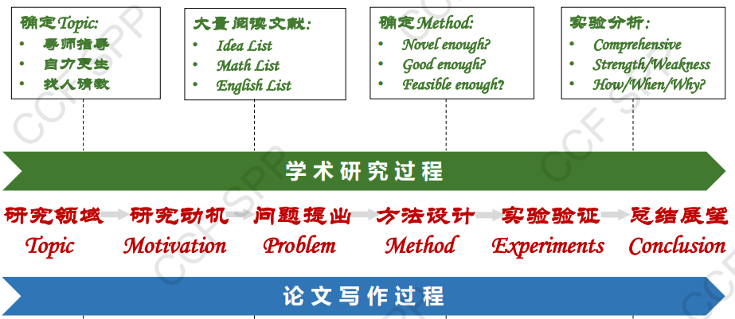
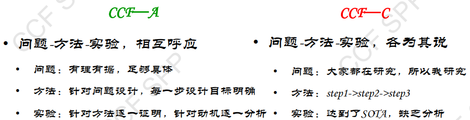
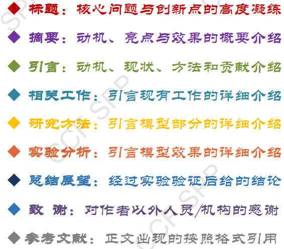
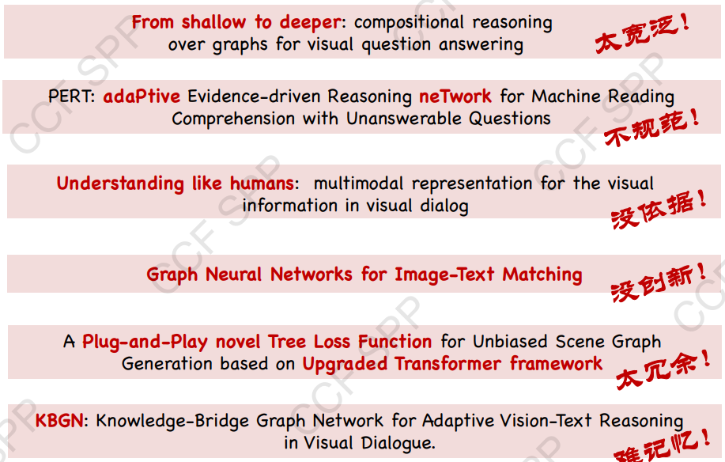
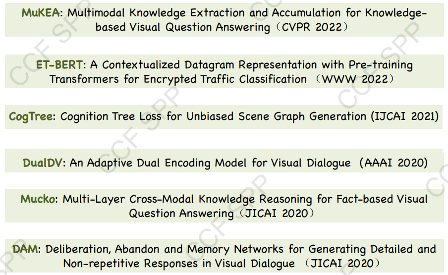
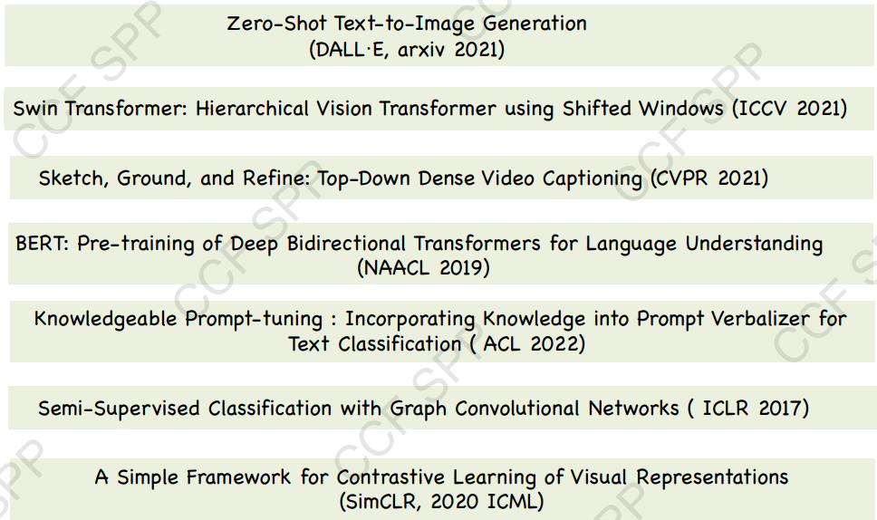
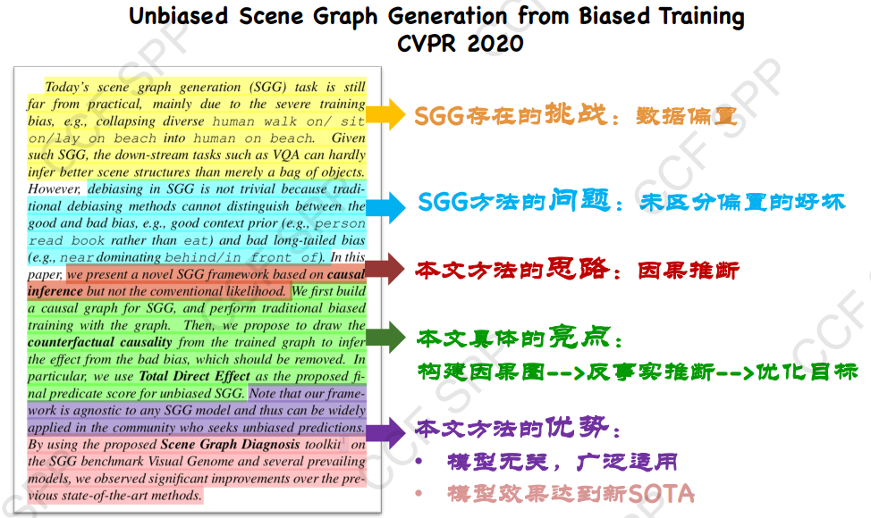

# EnglishPaperWrittenMethodlogy && How to Academic

***Why do you want to be academic?***

---
from:Yu Jing “English Essay Collaboration Foundation”

---
Catalogue

1. Paper writing
2. Writing ideas
3. Figure & Table
4. English norms
5. Daily accumulation
6. Tips

---

## Paper writing

### How to do academic work

+ methodlogy : discovery problems-> systematcialy research-> raise a more effective solution-> proof it
+ quality ：logic, express, mindset
+ Long Term : share, communication, cooperation, competition

+ depict the problem

+ superior paper
  + problem : Focus on the ***frontier and essence***
  + method  : Focus on ***core challenges and universal approaches***

+ inferior paper
  + problem : Chasing field ***hotspots*** and solving ***surface*** problems
  + method  : ***Blind Method*** and ***Model splicing***

  ==***Question-guided approach***==

#### Title

1) Highlight the core issues and innovation

2) Easy to remember and spread

+ BAD Example:

+ GOOD Example:

#### Abstract

1) Structure: challenge, problem, ideas, highlights, advantages.

Specific:

#### introduction

==The introduction expands upon the abstract==

introduction = 
background(related knownledge && Complementary chanllenge)
+
Existing methods(Summary && Classification)
+
Summary problem (This article focuses on the issues)
+
Method Introduction
+
Contributions

+ new problem ?
+ new view ?
+ new framework ?
+ new method ?
+ is SOTA?
+ new capability?

#### Related Work
