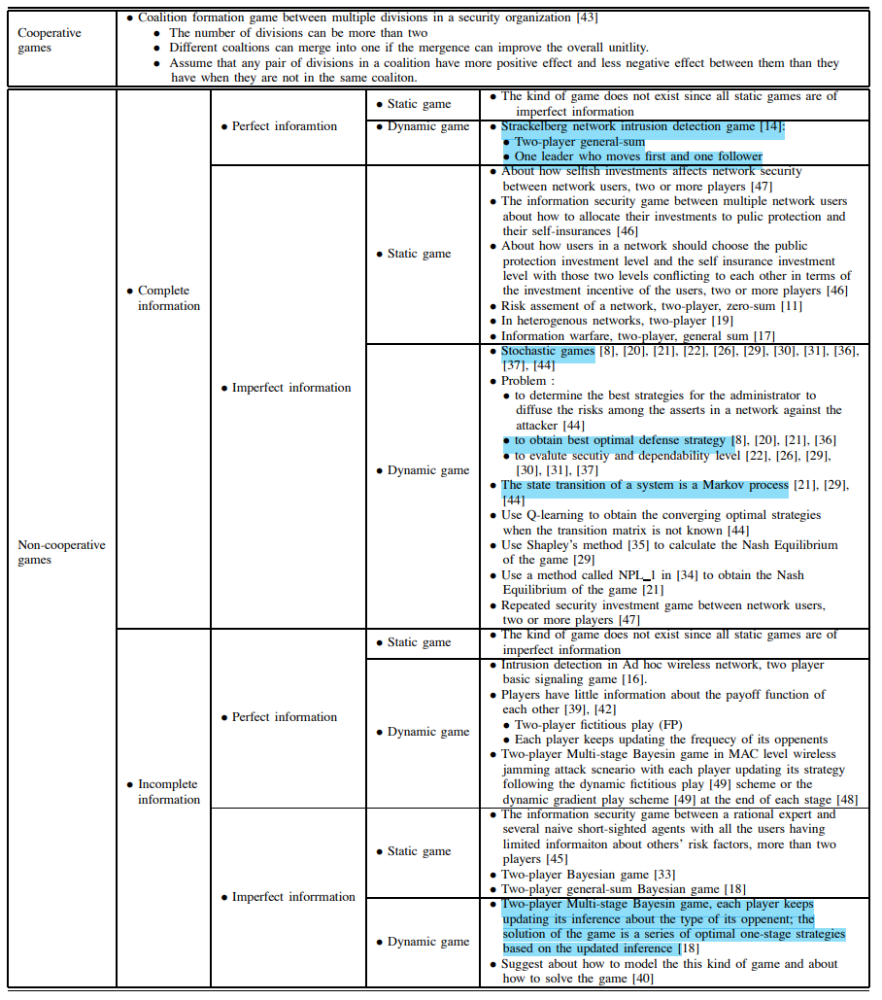

# 博弈模型分类

## 介绍

本文旨在将众多博弈模型通过不同角度分类，并且确定在网络安全攻防中存在何种博弈类型。

参考文献：Liang, X.; Xiao, Y. Game Theory for Network Security. IEEE Communications Surveys & Tutorials 2013, 15(1), 472–486. doi:10.1109/SURV.2012.062612.00056.

## 分类

- 单步博弈or多步博弈

    静态博弈：博弈者同时采取行动。静态博弈可以被看作是信息不完全的博弈，因为每次只有一个参与者参与。
    动态博弈：是一个由多个阶段或动作组成的游戏。阶段数可以是有限的，也可以是无限的。
    随机博弈：是一种动态博弈，其中有一个起始状态，状态可以根据过渡概率从一个状态过渡到另一个状态；在起始状态，博弈者采取行动并获得报酬，当前状态过渡到另一个状态。

- 完美信息博弈or非完美信息博弈
    完美信息博弈：每个玩家都知道玩家在移动时的所有先前**动作**。这种游戏的一个例子是国际象棋游戏。（从一开始就能观察全局）
    非完美信息博弈：至少有一方不知道完全的**行动信息**。

- 完全信息博弈or非完全信息博弈

    完全信息博弈：知道所有的博弈方**收益**。
    非完全信息博弈：至少一方不知道所有参与者的。

## 网络安全攻防中博弈论的应用

1. 网络攻击-防御分析（定量决策）应用：将攻击者和防御者之间的相互关系建模为博弈，预测攻击者的行动，并确定应对的防御策略。

    1.1 网络攻防一般性分析
        场景是一个攻击者对一个防御者。
        攻击者的行动是攻击和什么也不做。
        防御方的行动是防御和什么也不做。

    1.2 网络攻防专门分析
        1.发生攻击事件的专门网络、更复杂的攻击或防御行动，或考虑防御者和攻击者之间的多个交互阶段。

2. 网络安全性和可靠性评估应用：预测攻击者和防御者的策略，并根据预测结果评估系统的安全性。

