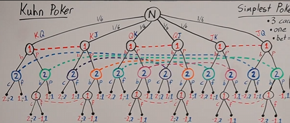
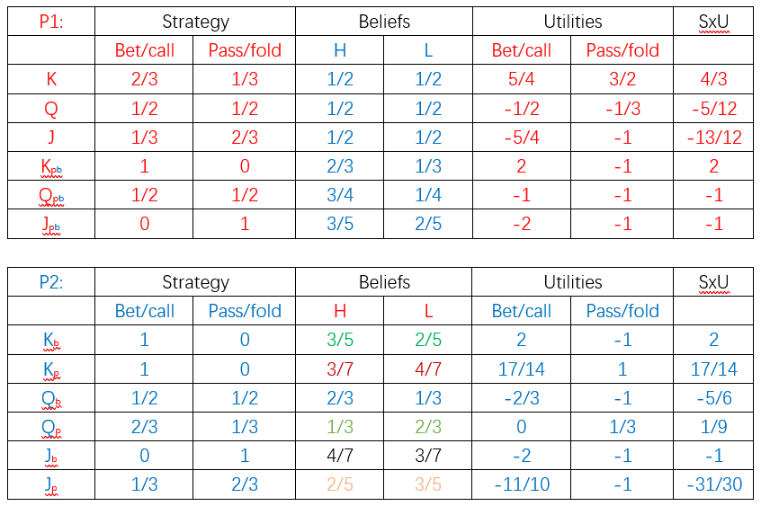

# CFR-DO-PSRO-EFDO

## 1.CFR (Counterfactual Regret minimization)

Counterfactual regret minimization is a technique which has been known as one of the best approaches for creating approximate Nash equilibrium solutions for Extensive-form game.(Small scale)

### Kuhn poker

a simple model zero-sum two-player imperfect-information game

Step1.Top to Bottom: Compute beliefs
Step2.Bottom to Top: Compute Utilities

Computation example:
$Pr(K/Qb)=\frac{\frac{1}{3}\frac{2}{3}}{\frac{1}{3}\frac{2}{3}+\frac{1}{3}\frac{1}{3}}=\frac{2}{3}$
$P_{r}(Q|K_{P}b)=\frac{\frac{1}{2}\frac{1}{3}\frac{2}{3}}{\frac{1}{2}\frac{1}{3}\frac{2}{3}+\frac{1}{2}\frac{1}{3}\frac{1}{3}}=\frac{2}{3}$

### Two aspect

#### No.1

initialize gain for every action at every info. set
$\sigma^0\leftarrow{Norm(gains)}$
For $t = 1... T$

- calculate Utilies of $\sigma^{t-1}$at every info. set
- update gains,weighted by reach probability
- $\sigma^t\leftarrow{Norm(gains)}$
  
return $\sigma^t$

eg.P1:
$gains(K_P)=1/6,3/2-4/3$
$gains(K_B)=0, because 5/4<4/3$
New stratgy profile $K(Pr_B(0),Pr_P(1))

#### No.2

step1.**Counterfactual value**

Raletionship between utility $u$ and counterfactual value $v$
\[\begin{aligned}
&\begin{aligned}u_p^\sigma(h)=\Sigma_{z\in Z,h\subset z}\pi^\sigma(z)u_p(z)\end{aligned} \\
&=\Sigma_{z\in Z,h\sqsubset z}\pi^\sigma(h)\pi^\sigma\left(z|h\right)u_p(z) \\
&=\Sigma_{z\in Z,h\sqsubset z}\pi_p^\sigma(h)\pi_{-p}^\sigma(h)\pi^\sigma(z|h)u_p(z) \\
&=\pi_p^\sigma(h)\Sigma_{z\in Z,h\subset z}\pi_{-p}^\sigma(h)\pi^\sigma(z|h)u_p(z) \\
&=\pi_p^\sigma(h)v_p^\sigma(h)
\end{aligned}\]

$v_p^\sigma(h)=\sum_{z\in Z,h\subset z}\pi_{-p}^\sigma(h)\pi^\sigma(z|h)u_p(z)$

$v_p^\sigma(h)=\frac{u_p^\sigma(h)}{\pi_p^\sigma(h)}$

step2.**Regret value**

$R^{t}(I,a)=R^{t-1}(I,a)+v_{p}^{\sigma}(I,a)-\sum_{a\in A(I)}\sigma^{t}(I,a)v_{p}^{\sigma^{t}}(I,a)$

step3.**Adjust stratgy** and  **Normalize**
$\sigma_{p}^{t}(I,a)=\begin{cases}R^{\prime}(I,a)^{+}/\sum_{A\in A(I)}R^{\prime}(I,b)^{+}&\sum_{b\in A(I)}R^{\prime}(I,b)^{+}>0\\\frac{1}{|A(I)|}\end{cases}$

### 重要性

## 2\.DO (Double Oracle)

Double Oracle is an iterative algorithm for solving two-player zero-sum normal-form games via linear program and is guaranteed to converge to an approximate NE.

### 定义

### 背景

### 重要性

## 3.PSRO (Policy Space Response Oracles)

Policy space response oracles is a variant of Double Oracle replacing BR oracles with reinforcement learning, achieves success in Starcraft and Stratego.

### 定义

### 背景

### 重要性

## 4.EFDO (Extensive-form Double Oracle)

### 4.1 Advantage

Extensive-form is much
more attractive than normal form in terms of the ability of
representation and application significance.

### 背景
### 重要性

[1] M. Zinkevich, M. Johanson, M. Bowling, and C. Piccione, “Regret
minimization in games with incomplete information,” Advances in
neural information processing systems, vol. 20, 2007.
[2] H. B. McMahan, G. J. Gordon, and A. Blum, “Planning in the presence
of cost functions controlled by an adversary,” in Proceedings of the
20th International Conference on Machine Learning (ICML-03), 2003,
pp. 536–543.
[3] M. Lanctot, V. Zambaldi, A. Gruslys, A. Lazaridou, K. Tuyls, J. P´erolat,
D. Silver, and T. Graepel, “A unified game-theoretic approach to multiagent
reinforcement learning,” Advances in neural information processing
systems, vol. 30, 2017.
[4] O. Vinyals, I. Babuschkin, W. M. Czarnecki, M. Mathieu, A. Dudzik,
J. Chung, D. H. Choi, R. Powell, T. Ewalds, P. Georgiev et al., “Grandmaster
level in starcraft ii using multi-agent reinforcement learning,”
Nature, vol. 575, no. 7782, pp. 350–354, 2019.