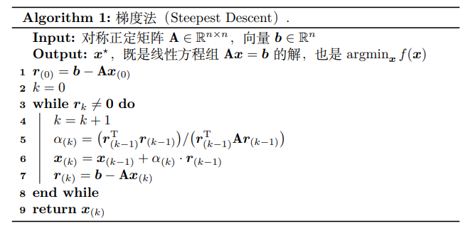
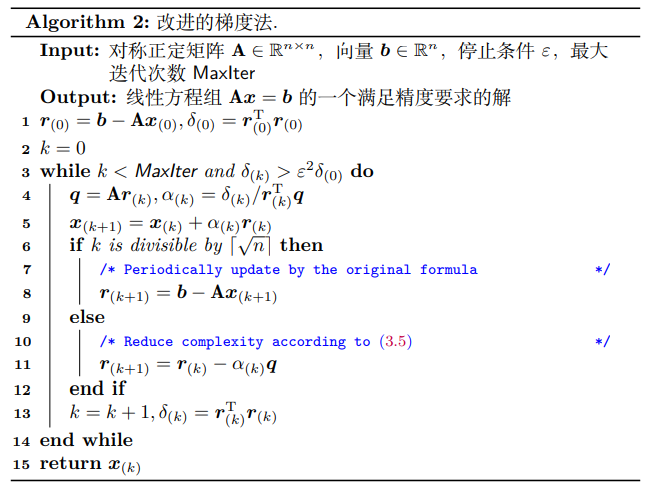

# 共轭梯度法如何理解

参考：<http://hliangzhao.me/math/CG.pdf>

## 目录

- [共轭梯度法如何理解](#共轭梯度法如何理解)
  - [目录](#目录)
  - [0.共轭梯度法用于解决哪类优化问题](#0共轭梯度法用于解决哪类优化问题)
    - [重要的](#重要的)
    - [（前置知识）二次型（the Quadratic Form）](#前置知识二次型the-quadratic-form)
  - [1.最速下降法](#1最速下降法)
    - [1.1 迭代方向](#11-迭代方向)
    - [1.2 迭代步长](#12-迭代步长)
    - [1.3 如何实现](#13-如何实现)
    - [1.4（前置知识）特征值相关性质](#14前置知识特征值相关性质)
      - [.1 谱半径](#1-谱半径)
      - [.2 雅可比迭代](#2-雅可比迭代)
      - [1.5 最速下降法-收敛性分析](#15-最速下降法-收敛性分析)
  - [2.共轭梯度法](#2共轭梯度法)
    - [2.1 什么是共轭](#21-什么是共轭)
    - [2.2 格莱姆-施密特过程](#22-格莱姆-施密特过程)
    - [2.3 共轭梯度法具体构造](#23-共轭梯度法具体构造)
    - [2.4 共轭梯度法的收敛性](#24-共轭梯度法的收敛性)
    - [2.5 共轭梯度法实现](#25-共轭梯度法实现)

## 0.共轭梯度法用于解决哪类优化问题

求解无约束非线性优化问题

主要求解方法:

    1.主要利用是一维搜索（line search）：其核心是找到合适的**迭代方向**和每次迭代的**最优步长**。
    2.另一类无约束非线性优化的算法是信赖域方法。本质上，信赖域方法是在局部用二次型插值目标曲线，仍就是借助多项式的强大表示能力。

根据有无曲线信息可用:

    1.如果**没有**曲线信息可供利用：黄金分割法、斐波那契法等方法缩小搜索区间，也可以借助多项式的强大表示能力执行插值法（牛顿法就是二点二次插值）；
    2.如果**有**信息可用：借助泰勒展开式获得迭代方向。
        有一阶信息：采用梯度法（最速下降法）
        有二阶信息：采用牛顿法

- 但是，牛顿法的两大问题分别是 Hessian 矩阵不总正定的Hessian 矩阵的逆太难算。
 ==改进策略：保证**迭代方向一定是函数下降的方向**（保证Hessian 矩阵正定）。共轭梯度法（Conjugate Gradient method, CG）就是一种常用的改进方法。==

### 重要的

下文将以**共轭梯度法为最终目标，从两个方向讨论一维搜索，迭代方向和最优步长的选择和优化方法**

思路：最速下降法-收敛性->共轭梯度法-收敛性

### （前置知识）二次型（the Quadratic Form）

二次型的作用:一个从向量映射到标量的函数：

假设有二次型，且A正定：
\[
    f(x):=\frac{1}{2}x^TAx-\mathbf{b}^Tx+c
\]

可知：

\[
\begin{align*}
\frac{\partial}{\partial x} \left( \frac{1}{2}x^T A x \right)
&= \frac{1}{2} \left( A x + A^T x \right) \\
\end{align*}
\]

\[
\frac{\partial}{\partial x} \left( -\mathbf{b}^T x \right) = -\mathbf{b}
\]

\[
\nabla f(x) = A x - \mathbf{b}
\]

我们可以求解出二次型的局部最小值的解。
\[
\frac{1}{2}(A+A^T)x=b
\]

根据局部极小值存在的一阶必要条件,设微小扰动$e$
$x^*=A^{-1}b$, $x=x^*+e$
带入二次型得到：
\[
f(x^*+e)>f(x^*)
\]
这说明当 A 是一个对称正定矩阵时，通过求解 Ax = b 得到的就是 f(x) 的全局最小值。==这相当于把一个二次型的最优化问题转变成了线性方程组的求解问题。==

## 1.最速下降法

### 1.1 迭代方向

作为一种一维搜索算法，梯度法采取函数梯度的反方向作为迭代方向。

梯度选择的方向是$b-Ax_{(i)}$

说明性定义：
    + 误差向量：$e_{(i)}:=x_{(i)}-x^*$ 当前点和最小值点$x^*$的距离。
    + 残差向量: $r_{(i)}:=b-Ax_{(i)}$ 最速下降的方向，$Ax$和$b$的距离。
    （在二次型中讨论的**对称矩阵**的微分$\nabla_x{f(x)}=Ax-b$，对于非对称矩阵梯度法也会采用这个方向，所以梯度法收敛性有待讨论。）

由残差向量$r_{(i)}:=b-Ax_{(i)}$可以变换出$r_{(i)}:=b-Ax_{(i)}=Ax^*-Ax_{(i)}=-Ae_{(i)}$

### 1.2 迭代步长

那么更新步长的定义可以给出:
$x_{(i+1)}\leftarrow x_{i}+\alpha·r_{(i)}$

==当前，我们知道二次型$f$中蕴含全部的方向和步长信息，那么我们可以将$f(x_{(i+1)})$视为$\alpha$的函数，即$ψ(\alpha)$，那么我们可以通过求解$ψ(\alpha)$在局部极小值存在的一阶必要条件，来获得最优的步长的相关信息。==

如下推导：

\[
\begin{align*}
\nabla ψ(\alpha) &= \nabla f(x_{(i+1)})\\
&= {\nabla f(x_{(i+1)})}^T\nabla_{\alpha} x_{(i+1)}\\
&= {-r_{(i+1)}}^T r_{(i)}\\
&= 0
\end{align*}
\]

表明最优步长 α 使得前后两轮的迭代方向相互垂直（正交）

通过${r_{(i+1)}}^Tr_{(i)}=0$
可以推导出：

\[
\begin{align*}
{r_{(i+1)}}^Tr_{(i)} &= (b-Ax_{(i+1)})^T r_{(i)}\\
&= {[b-A(x_{(i)}+\alpha·r_{(i)}]}^Tr_{(i)}\\
&= (b-Ax_{(i)})^Tr_{(i)}-\alpha ({Ar_{(i)})}^Tr_{(i)}\\
&= {r_{(i)}}^T r_{(i)}-\alpha {r_{(i)}}^TAr_{(i)}\\
&= 0
\end{align*}
\]

因此，确定$\alpha=\frac{{r_{(i)}}^Tr_{(i)}}{{r_{(i)}}^TAr_{(i)}}$
当 A 为对称正定阵的时候，梯度法一定可以收敛到全局最优解。

### 1.3 如何实现

伪代码如图：

若用$r_{(k-1)}-\alpha Ar_{(k-1)}$替代$b-Ax_{(k)}$更新$r_{(k)}$避免了第 7 行的矩阵-向量乘法。

- 但这种降低复杂度的策略是以牺牲计算$r_{(k)}$的精度为代价的。因为$r_{(k)}$的计算没有用到最新的$x_{(k)}$，所以会有舍入误差。这个问题可
以通过定期重新采用$b-Ax_{(k)}$更新$r_{(k)}$ 解决

改进后的伪代码如图：

### 1.4（前置知识）特征值相关性质

求解线性方程组的迭代算法通常会反复将一个矩阵作用在一个向量上。

#### .1 谱半径

**特征向量的理解:**
==设$v$是矩阵$B$的一个特征向量，则存在常数 λ 使得$Bv = λv$。也就是说，当$B$作为一个线性变换作用到向量$v$上时，只会让$v$在所在方向上发生长度的伸缩或变成反向向量，而不会发生旋转变换。==

- 若 $|λ| < 1$，那么 $lim_{k→∞}B^kv$会收缩至 0;
- 若 $|λ| > 1$，那么 $lim_{k→∞}B^kv$会趋于 ∞。

**矩阵运算的物理理解：**
==如果将向量看成线性空间中的一个点，那么左乘矩阵可以看成是对点施加的一种运动（使点发生位移）。特征值反映了运动的速度，而特征向量则反映了运动的方向。线性变换是各个方向上不同速
度的运动的叠加。==

从这个理解出发，就会想明白为什么对于任意向量 x，不断左乘 B，x 会不断贴合到 B **最大特征值对应的特**征空间上。

**对于对称正定阵**:

- 可对角化当且仅当该矩阵具有 n 个线性无关的特征向量(特征值分解就是和对角阵互为相似矩阵)。
- $B$作用在任意向量$x$上时，可以将 x 用 B 的 n 个线性无关的特征向量 {v1, ..., vn} 的线性组合表示。既$x=\Sigma_{i=1}^{n}c_iv_i$, 那么$Bx=\Sigma_{i=1}^{n}c_i\lambda_iv_i$
- 我们总可以选取合适的特征向量使得
$∀i, c_i = 1$,那么$x=\Sigma_{i=1}^{n}v_i$,只有当所有特征值的绝对值均小于 1 时，$B^kx$才能收敛到 0
我们将最大的$\lambda$数值定义为 B 的谱半径（spectral radius）：$ρ(B) ≜ max_i|λ_i|.$

#### .2 雅可比迭代

- 通过迭代求解线性方程组$Ax=b$的经典方法
- Jacobi 方法是通过不断减小误差项来向真值逼近的

$Ax=b$展开可得：

\[
\begin{align*}
x_i=\frac{b_i-\Sigma_{j=1,j\neq i}^{n}a_{ij}x_j}{a_{ii}}
\end{align*}
\]

\[
\begin{align*}
x_i^{(k+1)}=\frac{b_i-\Sigma_{j=1}^{i-1}a_{ij}x_j^{(k)}-\Sigma_{j=i+1}^{n}a_{ij}x_j^{(k)}}{a_{ii}}
\end{align*}
\]
如果在更新$x_i^{(k+1)}$ 的时候对于所有排在其前面的$x_j$采用最新的数据$x_j^{(k+1)}$那么就得到了:
\[
\begin{align*}
x_i^{(k+1)}=\frac{b_i-\Sigma_{j=1}^{i-1}a_{ij}x_j^{(k+1)}-\Sigma_{j=i+1}^{n}a_{ij}x_j^{(k)}}{a_{ii}}
\end{align*}
\]
这就是 Gauss-Seidel 方法的迭代公式。

如果使用矩阵的方式表达应当是：
$A = L + D + U$
其中 L 是 A 的下三角部分，D 是 A 的对角线部分，U 是 A 的上三角部分。

\[
\begin{align*}
(L+D+U)x &= b\\
D^{-1}(L+D+U)x &= D^{-1}b\\
x &= D^{-1}(b-(L+U)x)\\
x^{(k+1)} &= D^{-1}(b-(L+U)x^{(k)})
\end{align*}
\]

定义：
$B = -D^{-1}(L+U)$, $z = D^{-1}b$
那么就有：
$x^{(k+1)} = Bx^{(k)}+z$

我们记$Ax=b$的真值为$x^*$，那么误差向量$e^{(k)}=x^{(k)}-x^*$
那么有：
$e^{(k+1)}=x^{(k+1)}-x^*=Bx^{(k)}+z-x^*=Be^{(k)}$
若$ρ(B) < 1$，则误差项可以收敛到 0，Jacobi 方法可以解出$x
^⋆$。同时我们也可以发现，初始向量$x(0)$虽然不影响最终的结果，但却会影响到收敛到给定误差范围内需要迭代的次数。

#### 1.5 最速下降法-收敛性分析

*矩阵的条件数：结合上面提到的几何意义，条件数同时描述了矩阵对向量的拉伸能力和压缩能力，换句话说，令向量发生形变的能力。条件数越大，向量在变换后越可能变化得越多。*

- 简单的

1)假设误差向量在矩阵A的基上(特征值对应的特征向量)，那么有：

\[
Ar_{(i)}=-\lambda_eAe_{(i)} = \lambda_er_{(i)}
\]

则
\[
\alpha_{(i)}=\frac{{r_{(i)}}^Tr_{(i)}}{{r_{(i)}}^TAr_{(i)}}=\frac{{r_{(i)}}^Tr_{(i)}}{{r_{(i)}}^T\lambda_er_{(i)}}=\frac{{r_{(i)}}^Tr_{(i)}}{\lambda_e{r_{(i)}}^Tr_{(i)}}=\frac{1}{\lambda_e}  
\]

带入迭代式
\[
e_{(i+1)}+x^*=e_{(i)}+x^*+\alpha_{(i)}r_{(i)}
\]

得到
\[
e_{(i+1)} = e_{(i)} + \frac{1}{\lambda_e}r_{(i)} = e_{(i)}-\frac{1}{\lambda_e}{\lambda_e}e_{(i)} = 0
\]

==这说明在该条件下梯度法只需要一次迭代即可抵达$x^*$。==

2)假设，A是对称正定阵，但误差向量$e_{(i)}$ 不是A的特征值λe所对应的特征向量。

A 可相似对角化。P是特征向量组成的酉矩阵。D是特征值组成的对角阵。

\[
A = PDP^{-1} = PDP^T  
\]

误差向量$e_{(i)}$可以用特征向量表示：
\[
e_{(i)} = \Sigma_{i=1}^{n}c_iv_i
\]
==我们将$v_i$视为基，相应地$ξ_i$是对应基上的坐标。将$v_1$视为$x$轴，$v_2$视为$y$轴，即可类比得到斜率$µ$==

则误差向量的2模$||e_{(i)}||^2 = \sigma_{i=1}^{n}c_i^2$。
A可以相似为$\lambda_{i}$组成的对角阵：
残差向量$r_{(i)}=-Ae_{(i)}=-\Sigma_{i=1}^{n}c_i\lambda_iv_i$。

则有：
\[
  \begin{align*}
  e_{i}^TAe_{i} &= (\Sigma_{i=1}^{n}c_iv_i^T)(\Sigma_{i=1}^{n}c_i \lambda_iv_i)
  &= \Sigma_{i=1}^{n}c_i^2\lambda_i
  \end{align*}
\]

\[
  \begin{align*}
  r_{i}^TAr_{i} &= (\Sigma_{i=1}^{n}c_i\lambda_iv_i^T)A(\Sigma_{i=1}^{n}c_i \lambda_iv_i)
  &= \Sigma_{i=1}^{n}c_i^2\lambda_i^3
  \end{align*}
\]
带入误差向量的迭代式可得
\[
  e_{(i+1)} = e_{(i)}+\alpha_{(i)}r_{(i)}
\]
当所有特征值相同时（认为矩阵A构成的场是一个各向均匀的场）
\[
  \begin{align*}
  e_{(i+1)} &= e_{i} + \frac{r_{(i)}^Tr_{(i)}}{r_{(i)}^TAr_{(i)}}r_{(i)} \\
  &= e_{i} + \frac{\Sigma_{i=1}^{n}c_i^2\lambda_i^3}{\Sigma_{i=1}^{n}c_i^2\lambda_i}(-\lambda e_{(i)}) \\
  &=0
  \end{align*}
\]
• 对于任意 n 阶方阵 A，若误差向量$e_{(i)}$ 是 A 的特征值$λ_e$ 所对应的特征向量，那么梯度法一步迭代即收敛；
• 若 A 是对称阵且所有特征值相同，则梯度法依然可以做到一步迭代即收敛。

- 一般的
  ==当误差向量为任意向量，而此时又存在多个不相等的非零特征值时（认为矩阵A构成的场是一个不均匀的能量场）。==

首先，定义误差向量的能量范数：从点$x
^*$出发的两个向量如果能量范数相同，那么它们的终点在$f(x)$的同一条等势线上。

\[
||e||_A^2 = e^TAe
\]

==相当于将任意的误差向量分解到了特征向量的基上，然后计算每个分量的能量。==

由能量范数可知：

我们只要分析$ω^2$ 的上界，就可以知道梯度法在最坏情况下的表现了。ω 越小，收敛速度越快。

借鉴上面的**谱半径**$κ = λ1/λ2 ≥ 1$和使用**特征向量的线性组合**$µ ≜ ξ2/ξ1$表达误差向量的思路，可以将$ω$化简为：

具体的$κ$和$µ$图像如下：

$κ$和$µ$越小，$ω$越小。$µ = ±κ$时$ω$最大。

- 若误差向量在特征向量上，其中一个系数为0，斜率为0或正无穷，$ω$=0；
  
- 若A特征值钧相等，谱半径为1，矩阵A构成的二次型接近于球形，在各个点均有合适的迭代方向。
- 若$κ$很大，此时 f(x) 的一极相对另一极长很多，如果初始点在山脊处，那么迭代方向还是很好找的，收敛速度不算慢；如果初始点在山谷处，那么梯度法只能朝着波谷方向曲折而缓慢的前进，每一步迭代作出的有效改进很小，收敛速度很慢。

如图直观感受：

（a）κ 大，µ 小；（b）κ 大，µ 大；（c）κ 小，µ 小；（d）κ 小，µ 大。

最差情况下$µ = ±κ$，满足：
$\omega^2 ≤ 1-\frac{4\kappa^4}{\kappa^5+2\kappa^4+\kappa^3} ≤ (\frac{\kappa-1}{\kappa+1})^2$

$\omega ≤ \frac{\kappa-1}{\kappa+1}$

$∥e_{(i)}∥^2_A$反应的是第 i 轮迭代时当前解和最优解之间在优化目标上的差距。

那么$\omega$和收敛速度的关系如下：
\[
  \frac{f(x_{(i)})-f(x^*)}{f(x_{(0)})-f(x^*)} ≤ \omega^{2i} ≤ \left(\frac{\kappa-1}{\kappa+1}\right)^{2i}
\]

## 2.共轭梯度法

- 在搜索方向上的改进

### 2.1 什么是共轭

- 可发现在梯度法中，同一个迭代方向可能会反复出现。
- **这意味着，对于重复出现的方向，对应的迭代没有完全消除误差向量在这个方向上的分量**
- 共轭方法就是:如果我们能找到 n 个相互正交的搜索方向 d(0), d(1), ..., d(n−1)，在每个方向上只移动一步即可完美消除误差向量在这个方向上的分量，那么只需要 n 轮迭代即可收敛到全局最优，复杂度将会大大降低

等价于：
\[
  -e_{(0)} = x^*-x_{(0)} = \Sigma_{i=0}^{n-1}c_id_i  
\]
本轮的误差向量和上一轮的搜索方向必然正交。

最优步长$\alpha_{(i)} = \frac{d^T_{(i)}e_{(i)}}{d^T_{(i)}d_{(i)}}$

$e_{(i)}$是第$i$搜索方向上的投影，是未知的。那么如何计算$\alpha_{(i)}$呢？

将正交的搜索方向$d_{(n)}$转变为A-正交（A-orthogonal）$d_{(n)}$。

*其中A-正交：若两个向量$p$、$q$，满足$p^TAq=0$,则称$p$和$q$是 A-正交的*

- 一般A-正交（p、q向量本省并不正交）和对称阵A-正交（p、q向量之间也正交）如图：

这类通过相互 A-正交的搜索方向来找到最优解的方法就被统称为共轭方向法法（conjugate directions methods）

**下面我们就可以来确定如何确定搜索方向和搜素步长了。**

我们还是从最原始的梯度法迭代方式出发来看。
**step 0.** $x_{i+1} = x_i + \alpha_id_i$
**step 1.** 反向初始向量误差$-e_0 = x^*-x_0 = \Sigma_{i=0}^n\alpha_id_i$
**step 2.** 第i+1轮的误差向量等于初始误差向量加上到i轮的搜索方向上的线性组合。$e_{i+1} = e_0 + \Sigma_{k=0}^i\alpha_kd_k = -\Sigma_{k=i+1}^{n-1}\alpha_kd_k$
**step 3.** 构造A-正交（修正误差向量的方向），$d_iAe_{i+1} = -\Sigma_{k=i+1}^n\alpha_kd^T_iAd_k = 0$其中$d^T_iAd_k = 0,i,k不相等$。
**step 4.** 确定步长，$\alpha_i = -\frac{d^T_ir_i}{d^T_iAd_i}$

值得注意的是这里的搜索方向$d_i$与之前的搜索方向是有区别的，这里的搜索方向是A-正交后的搜索方向。

可以通过将初始误差向量表示为A-正交搜索方向的线性组合的方式证明，$e_i = \Sigma_{j=i}^{n-1} c_j d_j$

**这个公式表明共轭方向法的每轮迭代是在逐项消除误差向量的分量。**

### 2.2 格莱姆-施密特过程

下面将确定使用什么样的方法构造A-正交的迭代方向。

- 通常的方法是共轭格莱姆-施密特过程（conjugate Gram-Schmidt process）。
  
首先，格莱姆-施密特过程（Gram-Schmidt process）如下：

- 该过程是一种将一组线性无关的向量正交化的方法。
- 该过程的核心思想是：将向量组中的每个向量减去其在前面所有向量上的投影，从而得到一组正交向量。
该过程的具体步骤如下：

然后进行单位正交化：

然后，将以上正交过程转换为A-正交，引入共轭格莱姆-施密特过程（conjugate Gram-Schmidt process）

### 2.3 共轭梯度法具体构造

我们首先给出CG的算法描述：

下面给出解释：由1.2.3.步骤可得到，搜索方向是由残差向量根据共轭格莱姆-施密特过程构造的。

至于为什么使用残差向量构造搜索方向见下：

- 构造搜索方向$d_i = p_i + \Sigma_{k=0}^{i-1}\beta_{ik}d_k$,其中$\beta = - \frac{p^T_iAd_j}{d^T_jAd_j}$
- 着构造 $d_i$ 的时候需要用到前面所有的迭代方向。
- 当$p_i$ 被设置为$r_i$的时候
\[
  \begin{align*}
  r^T_ir_{j+1} = r^T_ir_{j} - \alpha_jr^T_iAd_j\\
  \alpha_jr^T_iAd_j = r^T_ir_{j} - r^T_ir_{j+1}\\
  r^T_iAr_j &=-\frac{1}{\alpha_{i-1}}r^T_ir_i, (i = j+1)\\
  &=0,(otherwise)
  \end{align*}
\]
从而$\beta_{ij}$可以化简为：
\[
  \begin{align*}
  \beta_{ij} &= -\frac{1}{\alpha_{i-1}}\frac{r^T_ir_i}{d^T_{i-1}Ad_{i-1}}（j
  = i-1）\\
  &=0,(j < i-1)\\
  \end{align*}
\]
意味着除了最近一次的迭代方向的常系数不为零，其他都是零！因此，我们不再需要存储之前的
搜索方向了，这使得时空开销显著降低。这一优势让 CG 在每一轮迭代中的时间和空间复杂度均从
$O(n^2)$ 降低到了$O(m)$，其中$m$ 是 A 中非零元素的数量。

可以进一步简化为：
\[
\beta_{ij} = -\frac{1}{\alpha_{i-1}}\frac{r^T_ir_i}{r^T_{i-1}r_{i-1}}\\
d_i = r_i + \beta_{i-1}d_{i-1}  
\]

### 2.4 共轭梯度法的收敛性

### 2.5 共轭梯度法实现
