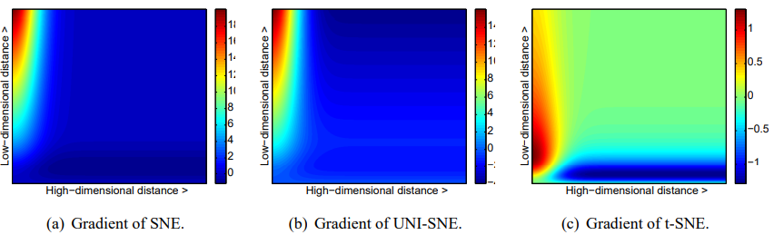

# 高维数据可视化方法

---
考虑的核心问题
==全局信息与局部信息的权衡==
==相似的点在降维后紧邻，不相似的点分离==

## 1.非线性方法

### 1.1 t-SNE(Stochastic Neighbor Embedding)

==基于t分布的KL散度降维方法==

#### 1.1.1 SNE方法

**将高维数据集转化为相似矩阵**，保持全局特征的情况下保留局部特点。
具体来说
    1.将高维数据的相似度由欧拉距离表示转变为条件概率。
    2.求低维数据概率分布和高维数据概率分布KL散度最小值。

- 高维数据概率分布：
$p_{j|i} =\frac{exp(-||x_i - x_j||^2 / 2σ_i^2)}{Σ_k≠i exp(-||x_i - x_k||^2 / 2σ_i^2)} $

- 低维数据概率分布：
$q_{j|i} =\frac{(1 + ||y_i - y_j||^2)^-1}{Σ_k≠i (1 + ||y_i - y_k||^2)^-1}$

- KL散度：
$KL(P||Q) = Σ_i Σ_j P_{i|j} log(P_{i|j}/Q_{i|j})$

3.其中重要的是对$σ$的选择，选择一个合适的$σ$使得数据在维度变换的时候，稠密度（稀疏度）合适==(Perplexity)==

- 由信息熵确定：
$Perp(Pi) = 2^{H(Pi)}$
$H(Pi) = -Σ p_{j|i} log2(p_{j|i})$

- 梯度下降法求解
$\frac{∂C}{∂y_i}= 2 * Σ_j (p_{j|i} - q_{j|i} + p_{i|j} - q_{i|j}) * (y_i - y_j)$
$\frac{∂C}{∂y_i}=Σ(Step) * (Direction)$

- 更新公式（二阶动量项）
$y^{t} = y^{t-1} - η * ∂C/∂y_i + \alpha(t)(y^{t-1}-y^{t-2})$

- 优化方法
  1.高斯噪声
  2.模拟退火
  3.多次尝试

#### 1.1.2 t-SNE方法

**t-（t分布）**：
 1.优化损失函数，对称版本的SNE
 2.拥挤问题，Student-t distribution heavy-tailed distribution rather than Gaussian

1.由SNE的条件概率分布转为求联合概率分布。
$KL(P||Q) = Σ_i Σ_j P_{ij} log(P_{ij}/Q_{ij})$

2.outlier的处理方式求两种视角下的平均值：
$P_{ij} = \frac{p_{j|i}+p_{i|j}}{2n}$
设定相似度的下限
$Σ_jp_{ij} > \frac{1}{2n}$

3.Crowding Problem
高维空间降到低维，距离位置信息（压缩）会丢失。

4.具体来说：t分布
$q_{j|i} = \frac{(1 + ||y_i - y_j||^2)^{-1}}{Σ_k≠i (1 + ||y_i - y_k||^2)^{-1}}$

梯度公式
$\frac{∂C}{∂y_i} = 4 * Σ_j (p_ij - q_ij) * (y_i - y_j) * (1 + ||y_i - y_j||^2)^{-1}$

效果：

### Umap

## 线性方法

### PCA-1933

### MDS-1952
