# 关于概率论和统计和信息论的统一

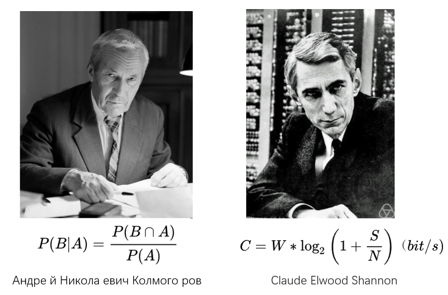

本系列笔记参照@王木头学科学概率论部分

## 1.概率论体系是如何建立

明确：**概率论是以可能性描述世界的工具**

条件满足：
    1）对事件本身的可能性描述
    2）对事件之间关系的描述

### 1.1 事件可能性直接赋值V1.0

**定义**：$f(S)=K$，事件$S=\{事件a, 事件b, 事件c,...\}$, 映射到$K=\{数值1，数值2，数值3\}$
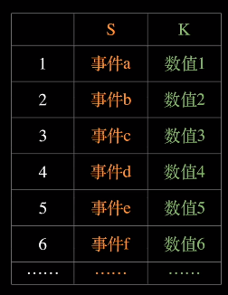
**如果**
$事件c = \{事件a, 事件b\}$
**则**
$数值3 = 数值1 + 数值2$

能表达事件可能性，也能体现事件之间的包含关系。
==》**问题**：过多的重合（冗余）定义之处，需要对原子性拆分。

### 1.2 拆分原子事件并归一表达V2.0

**定义**：$f(S)=K$，事件$S=\{原子事件a, 原子事件b, 原子事件c,...\}$, 映射到$K=\{数值1，数值2，数值3\}$
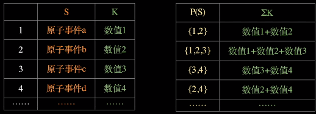

**可以计算事件的最大值**$\max(\sum{K})=\sum_{s\in{all}}f(s)$

**进行归一化**
$\hat{K} = \frac{K}{\sum_{s\in{all}}f(s)}\in[0,1]$

剔除了冗余的关系，归一化表达强化数学分析性和可解释性。
==》**问题**：无法确定原子性的拆分尺度，无法解决离散问题。

### 1.3 用区间形式定义连续行事件

**在$σ-域$中定义累积分布**
由PS中4.5确定，使用自然数的幂集可以对实数集双射。因此可以定义：
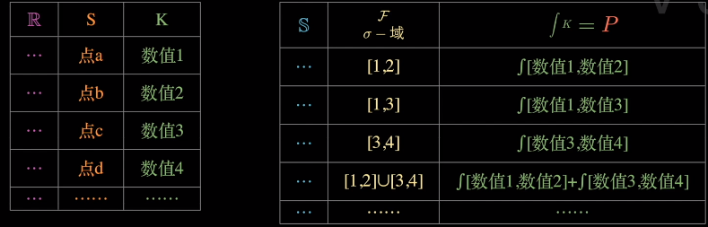

$F(x)=事件(-∞, x]$的可能性，$x\in{\mathbb{R}},(-∞,x]\in{\mathcal{F}}$

$\to{f(x)=F'(x)=K}$

**我们得到：**
$S$样本空间
样本空间中的区间表示连续事件

**：：可知重要的**：样本空间中的点到实数域中的“映射”被命名为：==随机变量== $X(s)\in{R}$

==我们通过随机变量构建了概率空间和实数空间的映射关系==
$\{Ω(样本空间),\mathcal{F}(σ-域),P(测度)\}$==>$\{R,\mathcal{F}(σ-域),P(测度)\}$
***
PS：
*1.群：一个非空集合$G$，配以**一个**二元运算，定义了一种封闭的代数结构，具有封闭性、结合律、单位元和逆元。*

*2.阿贝尔群：一个群，如果其满足**交换律***

*3.环：群的基础上引入了**第二个二元运算**，并且保持了加法的交换性，但乘法不一定需要满足交换律。*

*4.域是环的一个更强大的扩展，要求乘法操作中，除了 0之外的元素都有逆元。域**同时满足**加法和乘法的结合律、交换律以及分配律。*

*5.**康托尔连续统假设**：（Cantor's Continuum Hypothesis）：自然数集合的势，定义为$ℵ_0$，则自然数的幂集和实数集合是等势的，定义为$ℵ_1$，而实数集的幂集，定义为$ℵ_2$*

*6.势：（cardinality）是用来衡量集合大小的概念，等势的集合，可以建立双射。*

***

### 1.4小结

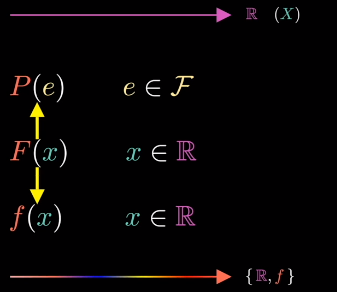

+ 明确理解一维情况下分布函数$F$和概率$P$，分布函数$F$和概率密度函数$f$的关系。

## 2.多维随机变量之间的关系

### 2.1联合概率、边缘概率与条件概率

联合概率分布定义：
$F(X_1=a,X_2=b)$
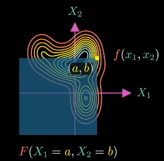

==边缘概率与条件概率实际是两种不同方式的降维操作。==

**边缘概率：**
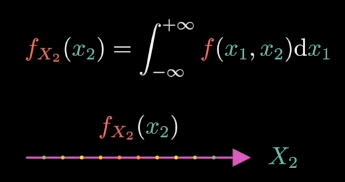
将二维空间质量按照$X_1$垂直方向压缩到$X_1$轴上。

**条件概率：**

在$X_2=a$的情况下，得到随机变量$X_1$的概率密度函数。

## 3. 概率论-数理统计-信息论的联系

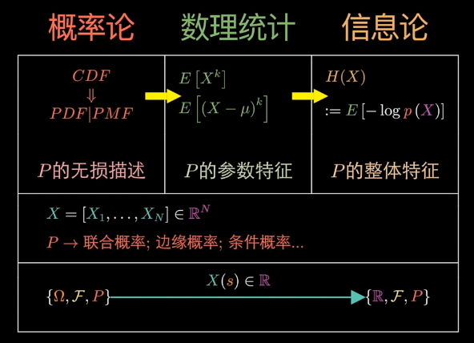

### 3.1 概率论

**P的无损描述：**
*我们以两个随机变量的和的形式讨论这个问题*

$Z=X+Y$
=>$f_z(a)=P\{X+Y=a\}$
=>$F_z(a)=P\{X+Y\le{a}\}$
=>$\iint_{x+y\le{a}}f(x,y)ds$
令:$u=x+y,v=x$
=>$\iint_{u\le{a}}f(v,u-v)|J|ds'$

图像的坐标变换：**其中换元完成图像旋转，$|J|$完成图像拉伸**
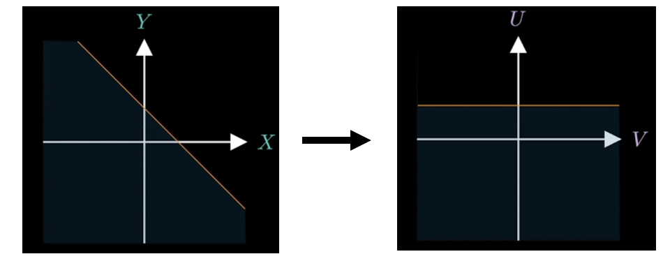
=>$\iint_{u\le{a}}f(v,u-v)|J|ds'=\int_{-\infty}^{a}[\int_{-\infty}^{+\infty}f(v,u-v)dv]du$
若量随机变量独立
=>$f_Z(a)=\int_{-\infty}^{+\infty}f(v,a-v)dv=\int_{-\infty}^{+\infty}f_X(v)f_Y(a-v)dv$
其中$\int_{-\infty}^{+\infty}f_X(v)f_Y(a-v)dv$是两个随机变量的**卷积**。

**可以深入理解的是**：==随机变量之间的操作：可以认为是两个变化系统以叠加在一起后，形成的新系统。（这种理解可以延申到信号处理领域，卷积神经网络领域等任何变化系统叠加的领域中。）==

### 3.2数理统计

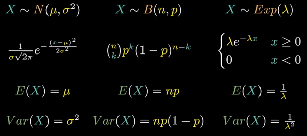

**参数特征**：（期望，方差）
分布的参数（统计量的意义）和只确定分布的类型（估计所完成的工作），就能确定分布的具体情况。

#### 3.2.1分布的参数

假设$(a^{[1]},a^{[2]},...,a^{[ n]})$是对$X$的n次抽样。

$\bar{a} = \frac{a^{[1]}+a^{[2]}+\dots+a^{[n]}}{n}$是不完整的期望$μ$
随机变量化：
$\bar{X} = \frac{X^{[1]}+X^{[2]}+\dots+X^{[n]}}{n}$

随机变量$\bar{X}$与随机变量$X$期望值$μ$和方差$σ^2$之间存在以下关系。

$Ε(\barΧ)=μ$
$Var(\barΧ)=\frac{σ^2}{n}$

如果是其他关系那么应该总能找到$Y=g(X^{[1]},X^{[2]},\dots,X^{[n]})$

==也就是说：数理统计通过统计量去评估样本遵循的概率分布。==
通过大数定律:$P(\lim_{n\to\infty}\bar{X_n}=μ)=1$
期望总是接近于平均值。
中心极限定理:$\bar{X}\sim{N}(\mu,\frac{\sigma^2}{n})$
分布总是服从于正态分布。

#### 3.2.2分布的类型

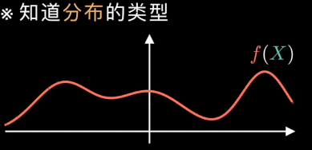

**1）估计的方法：**
$f(X)=b+\theta_1x+\theta_2x^2+\theta_3x^3+\dots=X^T·\theta=f(X|\theta)$
似然函数：
$f_all(X^{[1]}=a^{[1]},X^{[2]}=a^{[2]},\dots,X^{[n]}=a^{[n]}|\theta=z)$
$=\prod_{i=1}^nf(X^{[i]}=a^{[i]})=L(z)$

**2）拆分的方法**
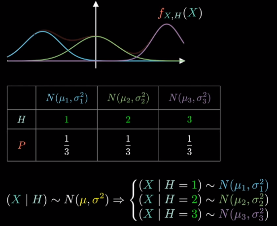

### 3.3 信息论

整体特征：对期望的扩展

**定义上：**
$H(X):=E[-\log{p(X)}]$
可以理解为：
$E[g(X)]=\sum_{x\in{all}}g(x)p(x)$
$g(X)=-\log{p(X)}$

可以对比的是：
$H(X)=\sum_{x\in{all}}-\log{p(x)}·p(x)\rightarrow(1)$
$2.E(X)=\sum_{x\in{all}}p(x)\rightarrow(2)$

+ (1)中$\log{p(x)}$代替(2)中$x$，使得$p(x)$的权重只与概率密度函数的分布本身有关，而与取值$x$无关,==适于分析系统的整体特征 ==。
+ 利用$\log$算符，容易的将概率之间的乘法转化成加法表达，==对于表达“信息”这一概念尤为合适$H(X,Y) = H(X)+H(Y)$==