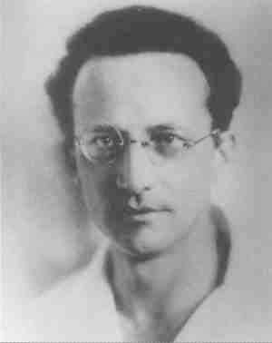

# 真随机是否存在

+ ***真随机实质上是讨论世界是否是客观的***

+ 真随机不是由于我们对系统认识或计算能力不够导致的不确定性。

+ **从量子力学角度回观概率论**
：概率论是讨论在某个空间中，空间中的所有点被赋予一个概率分布。--概率分布空间
：量子力学讨论在某个空间中，各个点本身被赋予了概率空间。--空间中点的概率分布（不明白看薛定谔方程的解释）

## 0.薛定谔方程

### 0.1类比的

薛定谔方程是量子力学中的牛顿第二定律（牛二是对力的**定义**，量子力学是对系统本身量子特性的**定义**）

### 0.2定义上

定义：$\hat{H}\Psi = i\hbar\frac{\partial\Psi}{\partial t}$
$\hat{H}$是哈密顿算符，$\Psi$是波函数，(波函数：是描述系统整体状态的)$\hbar$是约化普朗克常数。

**算符**可以当作是一个函数，它的作用是对函数进行操作，比如求导，求积分，求和等等。

### 0.3物理意义

具体上薛定谔方程可以表达为:
 $-\frac{\hbar^2}{2m}\nabla^2\Psi(\mathbf{x},t) + V(\mathbf{x},t)\Psi(\mathbf{x},t) = i\hbar\frac{\partial}{\partial t}\Psi(\mathbf{x},t)$

利用分离变量的形式表达波动方程：
$\Psi(\mathbf{x},t) = \psi(\mathbf{x})\phi(t)$

带入方程得到：
$-\frac{\hbar^2}{2m}\nabla^2\psi(\mathbf{x})\phi(t) + V(\mathbf{x},t)\psi(\mathbf{x})\phi(t) = i\hbar\frac{\partial}{\partial t}\psi(\mathbf{x})\phi(t)$

将位置信息放到左边，时间信息放到右边：
$-\frac{\hbar^2}{2m}\frac{\nabla^2\psi(\mathbf{x})}{\psi(\mathbf{x})} + V(\mathbf{x},t) = i\hbar\frac{\frac{\partial}{\partial t}\phi(t)}{\phi(t)}$

两边都是常数，记为E：
$-\frac{\hbar^2}{2m}\frac{\nabla^2\psi(\mathbf{x})}{\psi(\mathbf{x})} + V(\mathbf{x},t) = E = i\hbar\frac{\frac{\partial}{\partial t}\phi(t)}{\phi(t)}$

两边同时乘以$\psi(\mathbf{x})$：
$-\frac{\hbar^2}{2m}\nabla^2\psi(\mathbf{x}) + V(\mathbf{x},t)\psi(\mathbf{x}) = E\psi(\mathbf{x})$

将$\psi(\mathbf{x})$前的系数理解为操作符：**（定态薛定谔方程）**
$[-\frac{\hbar^2}{2m}\frac{d^2}{dx^2}+V]\psi(\mathbf{x})=E\psi(\mathbf{x})$

**$\psi(\mathbf{x})$这个波动函数应该包含系统的完备信息，通过哈密顿算符的操作就可以得出系统中的能量。**

这就是薛定谔方程的一般形式。
$[-\frac{\hbar^2}{2m}\frac{d^2}{dx^2}+V]$是哈密顿算符，用于求解一个系统的动能$-\frac{\hbar^2}{2m}\frac{d^2}{dx^2}$和势能$V$

**对于解的理解：**

其中$\psi(\mathbf{x})$系统位置函数的解集：也就是说，线性组合后$\psi(\mathbf{x}) = \sum_{i=1}^{n} c_i \phi_i(\mathbf{x})$仍然是方程的解，包含系统信息的$\phi(\mathbf{x})$是可以叠加的。

对于$i$的取值是针对$E$的能量形态，如果$E$是连续能量，${i \in \mathbb{R}}$；如果$E$是含有势能场的能量--不连续的能量，则${i \in \mathbb{N}}$

## 1.关于薛定谔的猫

假设：$φ=c_1\phi_1+c_2\phi_2$
观察后会坍缩为$\phi_1$或$\phi_2$

玻恩定则：$P_i = |c_i|^2$

***
PS：向量与函数的关系：

+ 函数是无限维空间中的一个向量，每一个自变量是向量的一个维度，每一个因变量是向量在该维度下的分量。

***

### 1.1关于薛定谔方程的向量形式理解

定态薛定谔方程的向量形式：$\hat{H}\vec{\Psi} = E_j\vec{\Psi}$

将$\hat{H}$理解为一个矩阵，将$\vec{\Psi}$理解为一个向量，将$E_j$理解为一个数，那么这个方程就是一个矩阵方程。
**重要的**：这个矩阵只改变向量的大小，不改变向量的方向。这个向量就是特征向量（本征态）。

在测量中：薛定谔方程的解会坍缩到某一个本征态，本征态的本征值（特征值：能量$E$）必须是实数，（哈密顿算符是厄米算符，对角线为实数，非对角线为共轭复数）。

### 1.2超概率空间

对于玻恩定则，

$P_i = |c_i|^2$
