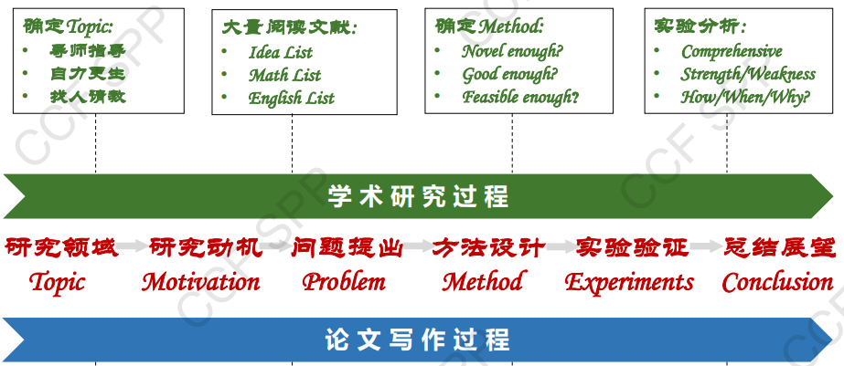
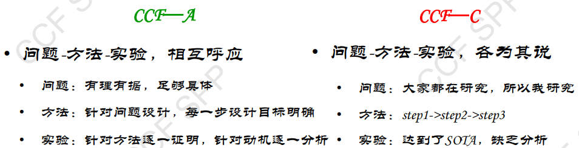
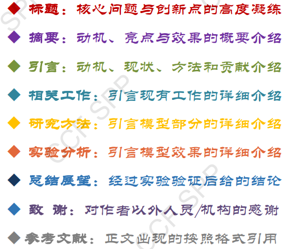
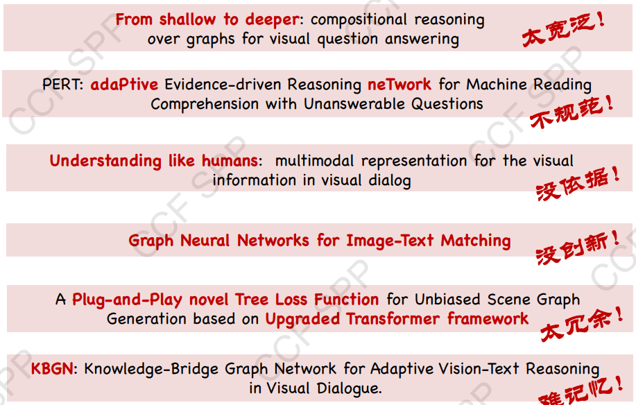
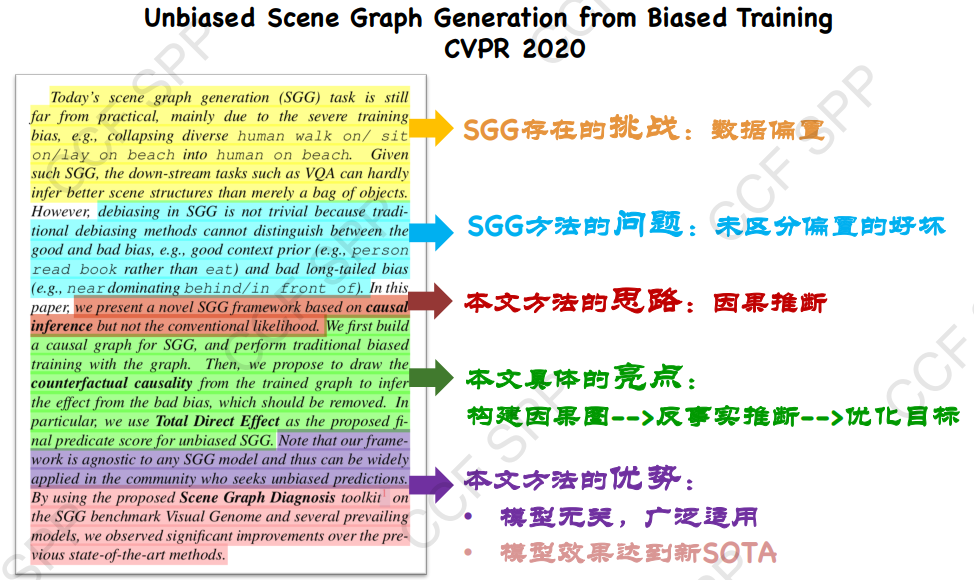
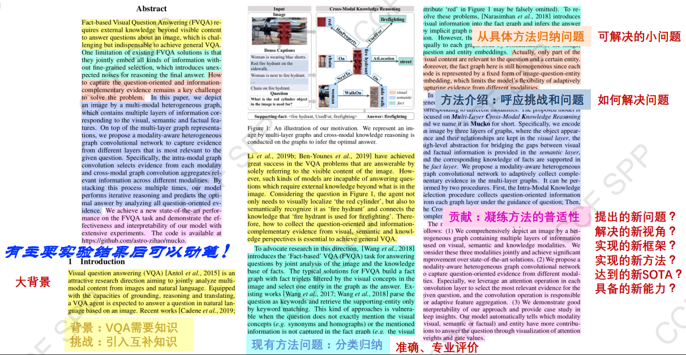
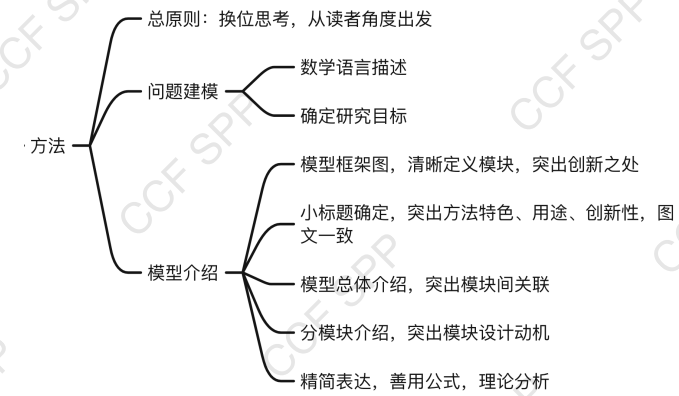
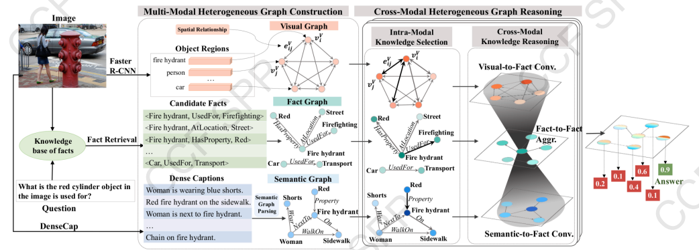
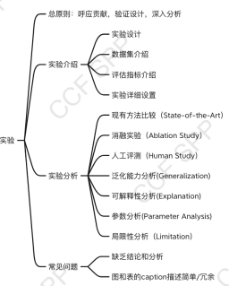
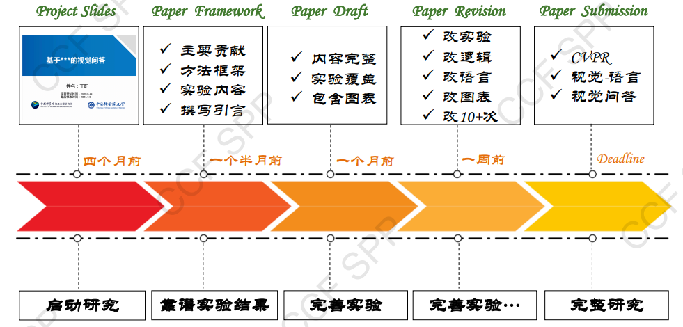

# EnglishPaperWrittenMethodlogy && How to Academic

***Why do you want to be academic?***

---
from:Yu Jing “English Essay Collaboration Foundation”

---
Catalogue

1. Paper writing
2. Writing ideas
3. Figure & Table
4. English norms
5. Daily accumulation
6. Tips

---

## Paper writing

### How to do academic work

+ methodlogy : discovery problems-> systematcialy research-> raise a more effective solution-> proof it
+ quality ：logic, express, mindset
+ Long Term : share, communication, cooperation, competition

+ depict the problem

+ superior paper
  + problem : Focus on the ***frontier and essence***
  + method  : Focus on ***core challenges and universal approaches***

+ inferior paper
  + problem : Chasing field ***hotspots*** and solving ***surface*** problems
  + method  : ***Blind Method*** and ***Model splicing***

  ==***Question-guided approach***==

#### Title

1) Highlight the core issues and innovation

2) Easy to remember and spread

+ BAD Example:

+ GOOD Example:

#### Abstract

1) Structure: challenge, problem, ideas, highlights, advantages.

Specific:

#### introduction

==The introduction expands upon the abstract==

introduction =
background(related knownledge && Complementary chanllenge)
+
Existing methods(Summary && Classification)
+
Summary problem (This article focuses on the issues)
+
Method Introduction
+
Contributions

+ new problem ?
+ new view ?
+ new framework ?
+ new method ?
+ is SOTA?
+ new capability?

#### Related Work

+ include all theme about your paper.
+ include all work about your revelant problem.

***BUT*** not put on **all paper you read** and **do not enumerate paper**.

==Draw out your contribution== in relation to the work of previous generations.

> eg.
> technologe one can be used in some field.
> paper one , paper two, paper three.
> however it still has some problem not solved. In this paper, we decipt the problem and give a new method to solve it.

#### Method

requirements

1) Focus on your contribution to the solution, from reader's perspective rather than your own(Time of input).
2) Enhance the description of motivation (why do you do this).
3) Highlight the your contribution in resolving the problem.

framework

+ first : framework figure
eg.
+ second : framework description ==(Consistent graphics and text)==

  1) Overall design idea.
  2) subtitle: ***precise*** and ***breif***.
  3) content :***motivation***, method, ***result***.
  4) details : Specific process.

#### Experiment

requirements

1) Alignment of ***theory, methodology and motivation***.
2) provide important results not the best case.
3) analysis of the results (resonable and objective).
4) The limitations of the method capabilities.

#### Conclusion

1) What is your discovery?
2) What kind of conclusion can be drawn from the problem you solved?
3) Future work.

Time line

