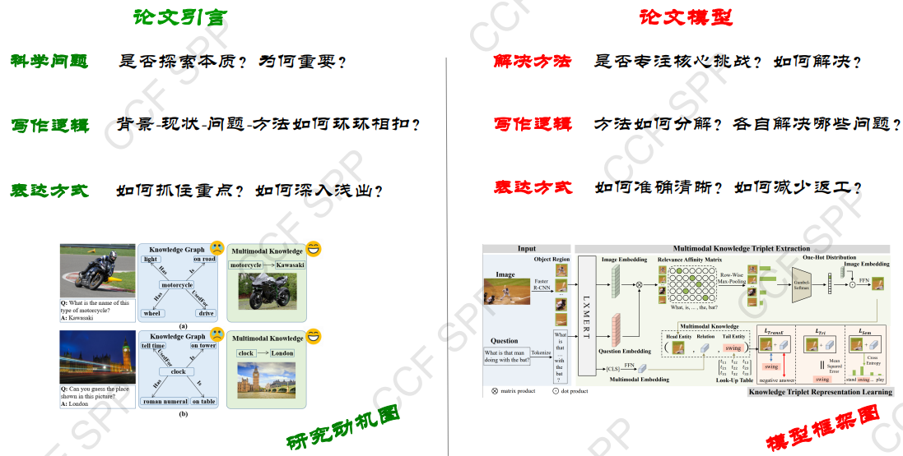
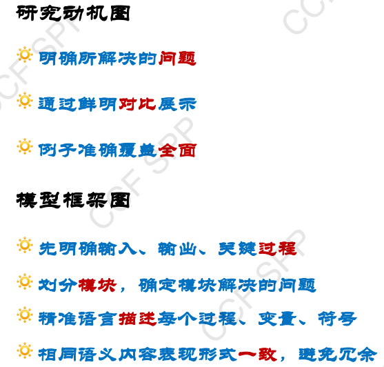
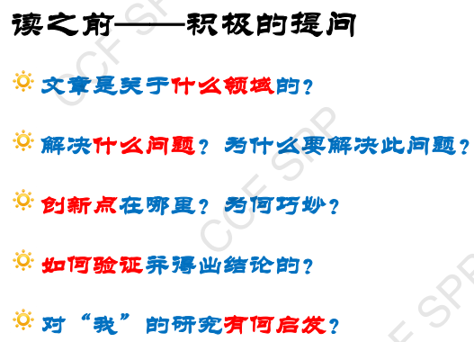
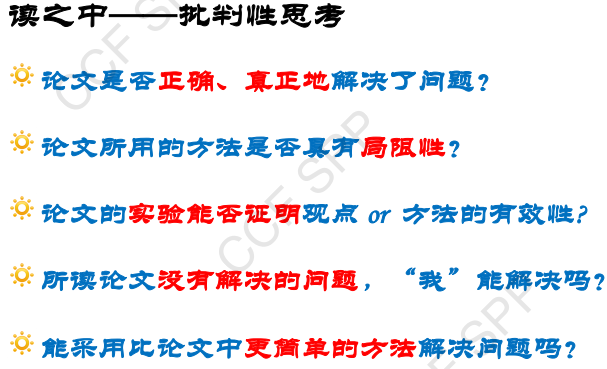
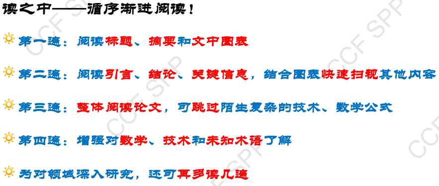
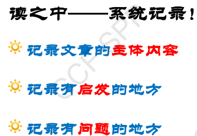
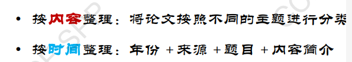
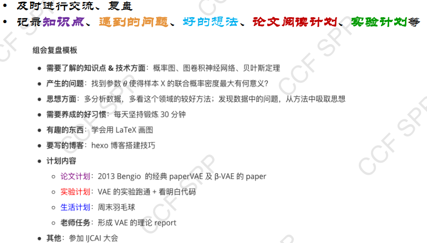
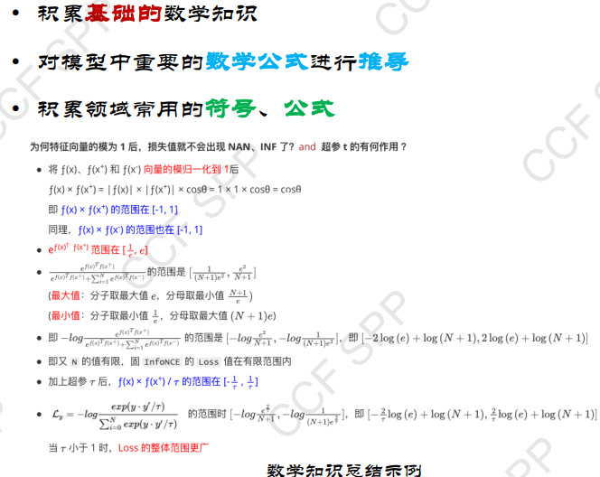

# EnglishPaperWrittenPractice

## Figure

***Research motivation diagram*** and ***Moduel framework diagram***

==Use the figure depicts your idea, and guaid your idea.==
Refine
==Without clear limitations, there is no clear capability.==

### Research motivation diagram

Requirements:

1) ***Dirctly*** show the ***motivation*** (core problem)of your research
2) From the read or the ***reviewer's*** perspective
3) Cover the different scenarios of your research
4) Figure ***abuntantly、 effectively and no ambiguity***  conveys information
5) Correspond to the content in the text

### Moduel framework diagram

Requirements:

1) Clear ***Process、Object、 Variety、Input and Output、Relationship among modules.***
2) Refine details and Distinguish the modules by color
3) Avoid  redundancy

## ***The process of perfecting the diagram is the process of combing ideas.***

## sammary

## Writting Regulation

### hard part

+ 1.briefly express
+ 2.Rigorous logic

### easy part

+ 3.professional words
+ 4.normal sign
+ 5.standard format
+ 6.objective graph
+ 7.correct reference
+ 8.Stick to academic morality

## accumulate

### paper list

+ select paper
  + classical paper and survey paper
  + from one point to the whole
+ read paper
  + to read :
    + 
  + reading :
    + 
    + 
    + 
  + read : 
+ ==communicate with others==
+ Sort out the papers

### Idea List

+ Review
eg. 

### Math List

