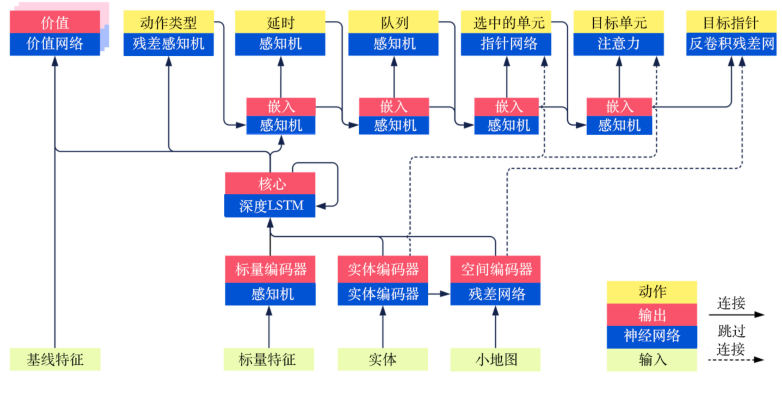

# AlphaStar 浅析

## 介绍

本文从alphastar项目学习以下内容：

+ 多源数据的融合
+ 如何构建一个复杂muilti-head的神经网络
+ 如何处理autogressive的问题

*本文参考：周博磊老师《强化学习纲要》中对AlphaStar的讲解，以及DeepMind的论文《AlphaStar: Mastering the Real-Time Strategy Game StarCraft II》。*

## 目录

+ [1. AlphaStar环境处理](#1-alphastar环境处理)
+ [2. AlphaStar训练方法](#2-alphastar训练方法)
+ [3. AlphaStar实验结果](#3-alphastar实验结果)

## 1. AlphaStar环境处理

### 1.1 如何处理Starcraft中复杂的观察状态

#### 1.1.1 观察分类

+ (列表)实体: Agent目前可以感知到实体.
  以列表和向量(信息嵌入)的形式构建
+ (图像)地图: 地理信息
  以多个二维矩阵的形式构建(20*176*200)
+ (向量)玩家数据: 玩家的信息.
+ (向量)全局标量信息:时间,相机位置.

#### 1.1.2 动作构建(自回归的构建方式)

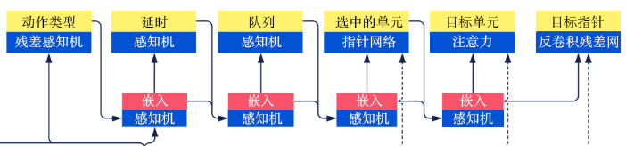

思路: 确定**动作类型**->确定**动作目标**->确定**动作参数**

第一部分:动作类型
————动作类型，即下一次要进行的动作的类型是移动小兵、升级建筑还是移动小窗口的位置等。

第二部分:动作目标
————选中的单元，承接第一部分，例如我们要进行的动作类型是移动小兵，那么我们就应该选择具体移动哪一个小兵。
————目标，承接第二部分，我们移动小兵A后，是要去地图的某一个位置还是去攻击对手的哪一个目标等，即选择目的地或攻击的对象。

第三部分:动作参数
————执行动作的队列，即是否立即执行动作，对于小兵A，是到达目的地后直接进行攻击还是原地待命。
————是否重复，如果需要小兵A持续攻击，那么就不需要再通过网络计算得到下一个动作，直接重复上一个动作即可。
————延时，即等候多久后再接收网络的输入，可以理解为一个操作的延迟。

### 1.2 复杂的神经网络结构

***利用Transformer和ResNet融合变长向量和minmap多模态信息***
***利用多头机制将action的各个环节串起来Autogressive***

#### 1.2.1 网络输出(信息编码)

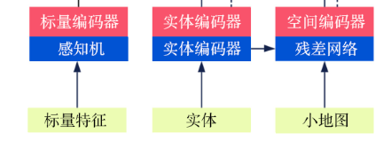
将状态观察中不同的数据通过不同类型的神经网络进行处理

值得注意的: 对于 ***实体*** 的处理

+ 变长 **列表和向量** 嵌套的形式用Transformer进行处理成等长的向量

#### 1.2.2 核心网络

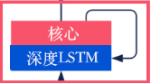
并且将该输出分别送入价值网络（value network）、残差多层感知机（residual MLP）以及动作类型的后续的多层感知机中。

#### 1.2.3 网络输出

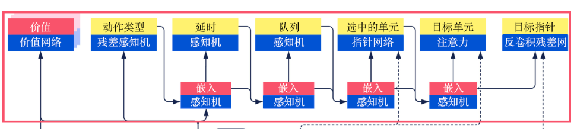

值得注意的:point_network的作用是

+ 在当前可以选择的实体中选择一个可以作为动作承接者的实体作为目标.

## 2. AlphaStar训练方法

### 2.1 有监督学习

***网络初始化问题***

如何做:1.解码人类对局. 2.输入观察网络得到概率分布. 3.计算智能体和人类选择之间的差距以优化网络

值得注意的:

+ 如何计算人类和智能体的选择差距?

    分类计算 如果是Action type=>交叉熵损失函数,
    如果是target location =>MSE损失函数

+ 假设当前head的输入是人类的选择
  
### 2.2 强化学习

***从奖励中学习潜在能力***

需要解决的问题:

    1)off-policy: [IMPALA结构] **优化网络结构的learner** 和 **与环境交互的actor** 分离
    2)动作空间和奖励函数的反馈解耦合
    3)价值函数的拟合,根据不同的对手拟合策略不同

如何解决:

    1)Actor-Critic结构:
<<<<<<< HEAD:ReforcementLearningNews/AlphaStar.md
        ac算法通过**重要性采样**方法解决学习的策略和采集到数据中的策略的不一致性问题
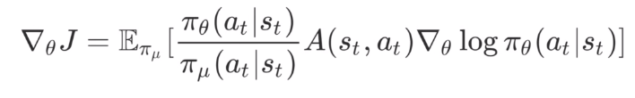
        通过引入V-trace,限制重要性采样之前策略比值(梯度)过大问题
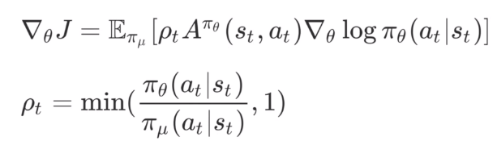
=======
  ac算法通过**重要性采样**方法解决学习的策略和采集到数据中的策略的不一致性问题
        
  
  
  通过引入V-trace,限制重要性采样之前策略比值(梯度)过大问题
        
  
>>>>>>> 26dab6c89b27224f525030efa68d93352818aebe:ReforcementLearningReview/AlphaStar.md

    2)UPGO算法:
    **将未来的乐观信息加入Advantage中**.
        解决优势估算的问题
<<<<<<< HEAD:ReforcementLearningNews/AlphaStar.md
        原始优势计算:
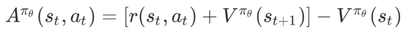
        upgo优势计算:
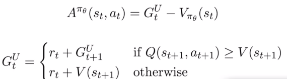
=======
  原始优势计算:
  
  
  
  upgo优势计算:
  
  
>>>>>>> 26dab6c89b27224f525030efa68d93352818aebe:ReforcementLearningReview/AlphaStar.md

    3)TD(λ)算法:
        ***价值函数是策略上向未来考虑多少***
        解决价值函数的拟合问题
<<<<<<< HEAD:ReforcementLearningNews/AlphaStar.md
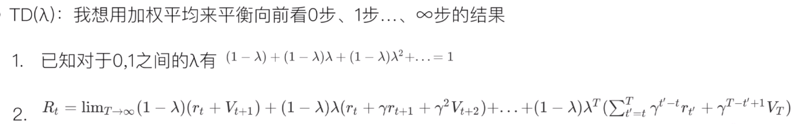
=======
  
>>>>>>> 26dab6c89b27224f525030efa68d93352818aebe:ReforcementLearningReview/AlphaStar.md

AlphaStar将我方和对方的观察同时输入价值网络，同时学习对手的收益和己方的收益。

    ***思考***：
    a.价值网络输入的是状态，因此可以不是单个智能体的观察
    b.价值网络用于计算优势更新策略，并不在实战中应用。
    c.价值网络输出的是一个策略在某状态下的预期收益。
    同时学习己方和对方的预期收益对策略优化而言数据利用率是翻倍的

### 2.3 模仿学习

***配合强化学习,模仿人类***

+ 如何进行模仿学习
  1) 监督学习初始化神经网络
  2) 人类统计量Z计算**伪**奖励函数
  3) 监督学习loss和强化学习的loss同时指导智能体

+ 人类统计量Z：
  使用汉明距离统计人类和智能体的选择差距
<<<<<<< HEAD:ReforcementLearningNews/AlphaStar.md
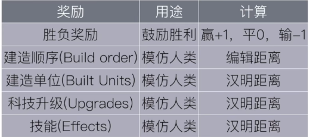
=======
  

>>>>>>> 26dab6c89b27224f525030efa68d93352818aebe:ReforcementLearningReview/AlphaStar.md
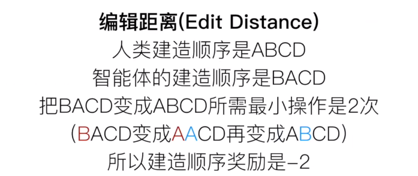

每一个伪奖励函数，都有各自独立的价值网络和loss函数。

### 2.4 多智能体和自学习

***超越人类表现***

**另一个核心问题**:挑选对手
训练过程中，每隔一段时间给自己存档得到一个智能体种群。随机均匀的从种群中抽出智能体作为对手。

#### 2.4.1 自学习

+ 自学习(Self-Play)
==>SP-策略循环问题的解决方案
+ 虚拟自学习(Fictitious Self-Play)
==>FSP-对手太菜问题的解决方案
+ 有优先级的虚拟自学习(Prioritized Fictitious Self-Play)

<<<<<<< HEAD:ReforcementLearningNews/AlphaStar.md
    1)按照胜利挑选对手（与高手对战）
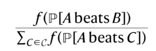
    2)不同智能体中的权重（多智能体部分）
=======
1)按照胜利挑选对手（与高手对战）
  

2)不同智能体中的权重（多智能体部分）
    
>>>>>>> 26dab6c89b27224f525030efa68d93352818aebe:ReforcementLearningReview/AlphaStar.md
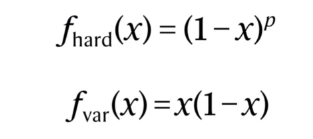

#### 2.4.2 多智能体（联盟学习）（League Training）

+ PFSP:对手是一个种群，其中的智能体是当前智能体的祖先
+ 这个对手池-称为“联盟”

有三类智能体：
1)Main Agent：（3个每个种族1个）用于训练和比赛。

+ 对手：
  + 50% 从league中按照PFSP选择.
  + 35% SP.
  + 15% 与League Exploiter(if 我胜率<30%>)对战或是老的主智能体对战（if 我胜率<70%）::f_hard(1-x)^p(p=2).
  + 存档频率和重置参数：2*10^9 time_steps; 永不重置。

2)League Exploiter：（6个每个种族2个）能打败所有智能体，发现全局性漏洞。

+ 对手：
  + PFSP:全联盟对手对战
  + 存档频率和重置参数：2*10^9 time_steps or 70% 胜率;
  有25%在存档中重置成监督学习的初始参数.

3)Main Exploiter（3个每个种族1个）能打败主智能体，发现主智能体漏洞。

+ 对手：
  + 随机从三个主智能体中抽取->若胜率>10%,则对战.若不能胜利则PFSP与老主智能体对战.f_var(x)=x(1-x)
  + 存档频率和重置参数：2*10^9 time_steps or 70% 胜率全胜3个主智能体;每次都重置成监督学习的初始参数.

## 3. AlphaStar实验结果

### 结论

+ 人类数据的利用:***监督学习和KL散度优化最为明显***
+ 价值函数:***引入敌方观察信息巨大提升***
