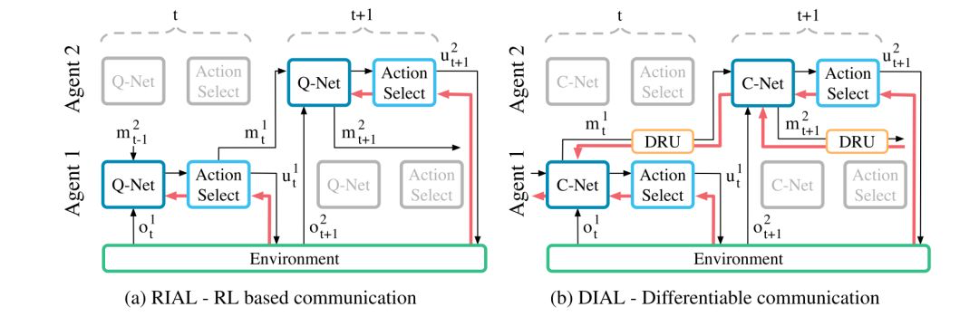
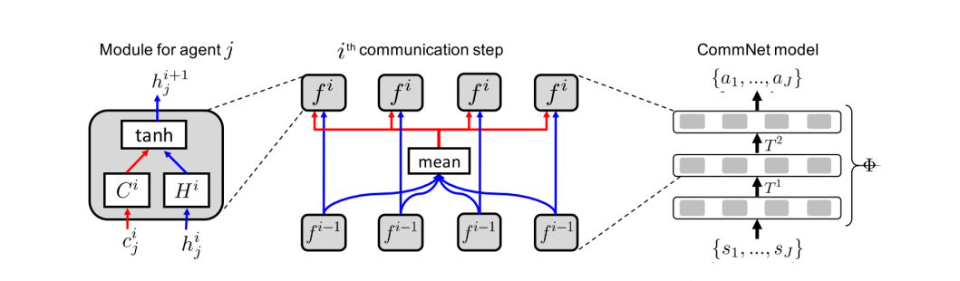
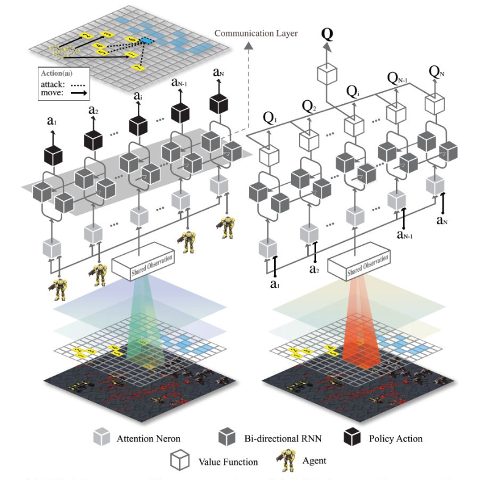

# 多智能体强化学习概述

## :wave:Introduction

多智能体方法分类
>Analysis of emergent behaviors（行为分析）
>Learning communication（通信学习）
>Learning cooperation（协作学习）
>Agents modeling agents（智能体建模）

---

## :wave:Section 1 行为分析

**行为分析**类别的算法主要是将单智能体强化学习算法（SARL）直接应用到多智能体环境之中，每个智能体之间相互独立，遵循 Independent Q-Learning 的算法思路。

---

[1.1 Multiagent Cooperation and Competition with Deep Reinforcement Learning](https://arxiv.org/abs/1511.08779)

本文要点

+ 1.这篇文章首次将 DQN 算法与 IQL 结合起来，并将其应用到 ALE 环境中的 Pong 游戏中
  
+ 2.通过设置不同类型的奖励函数对智能体行为进行讨论

>完全协作环境：一方失球，则两方均获得 -1 的回报
    - 在完全协作环境中，智能体学到的策略是尽可能长时间的不失球
完全竞争环境：一方失球，该方获得 -1 的回报；对方获得 +1 的回报
    - 而在完全竞争环境中，智能体学到的是如何更好的得分
非完全协作/竞争环境：一方失球，该方获得 -1 的回报；对方获得 的回报

+:thumbsup: **3.环境非平稳问题**
要有效解决环境非平稳问题的关键在于对智能体获取（感知）信息的能力做出讨论
可能是：1.通过通信的方式。2.通过将其他智能体的行为当作环境的变化。

:wink:***实验trick***
>Q 值的收敛一定程度上反映了 DQN 算法的收敛

==通过预先采样，预判是否收敛==：在训练之前首先随机在环境中采样一些 state 作为测试集，监控这些 state 对应的最大的 Q 值平均值来判断算法收敛与否

---

[1.2 Cooperative Multi-Agent Control Using Deep Reinforcement Learning](https://platformlab.stanford.edu/pdf/ALA2017_Gupta.pdf)

本文要点

+ 1.应用多种算法对局部观察的多智能体进行讨论。
   DQN、 TRPO 、DDPG 、 IQL、RNN
+ 2.类似**分布式人工智能的方式（FL）** 所有的智能体都共享同一套参数，训练时所有智能体采样得到的样本进行汇总，用来更新共享的模型参数。
+ 3.如何保证不同的智能体即使在共享参数的情况下也能够表现出不同的行为，其模型输入除了局部的观察外，还包括自身的索引。
  
:wink:***实验trick***
>课程训练：逐渐增加智能体数量

假设我们的课程学习环境是先从 2 个智能体开始训练，逐渐增加到最多 10 个智能体。

构建一个[**迪利克雷分布**](#appendix)该分布的概率密度函数最大值点初始偏向于较少的智能体个数，每一次训练时都从这个分布中采样智能体的个数并进行强化学习算法的训练，直到算法在这些采样出的环境中的性能都达到了某个阈值。

---

## :wave:Section 2 通信学习

**通信学习**属于这一类别的多智能体强化学习方法显式假设智能体之间存在信息的交互。
显式通信应当由
    1在训练过程中学习如何根据自身的局部观察来生成信息。
    2.确定是否需要通信、
    3.与哪些智能体通信。
在训练完毕后运行的过程中，==需要显式依据其余智能体传递的信息来进行决策。==

:thumbsup:**Dec-POMDP问题：**
全称为分散部分可观察马尔可夫决策过程 (Decentralized Partially Observable Markov Decision Processes)，是一种用于描述多智能体系统中的决策问题的数学模型。

在 Dec-POMDP 中，每个智能体都需要基于自己的局部观察来做出决策，而不是基于全局的状态。这反映了许多实际情况，例如在机器人协同任务中，每个机器人可能只能观察到自己周围的环境，而无法观察到整个环境的状态。

Dec-POMDP 模型由以下几个部分组成：

>·一组智能体
·一组状态
·每个智能体的一组动作
·每个智能体的一组观察
·状态转移函数，描述了给定当前状态和每个智能体的动作后，下一个状态的概率分布
·观察函数，描述了给定当前状态和每个智能体的动作后，每个智能体的观察的概率分布
·奖励函数，描述了给定当前状态和每个智能体的动作后，智能体获得的奖励

Dec-POMDP 的目标是找到一组策略，使得所有智能体的预期累积奖励最大化。这是一个非常具有挑战性的问题，因为每个智能体只能基于自己的局部观察来做出决策，而不能直接知道全局的状态。此外，智能体之间的动作可能会相互影响，因此需要协调他们的策略以达到全局的最优。

---

[2.1 Learning to Communicate with Deep Multi-Agent Reinforcement Learning](https://arxiv.org/abs/1605.06676)

本文要点

+ 1.这篇文章最先在深度多智能体强化学习中引入通信学习。
   >在 Dec-POMDP 中，所有智能体共享一个全局的回报函数，所以是一个完全协作环境，每个智能体只拥有自己的局部观察。文中假设通信信道是离散的，即智能体之间只能能传递离散的信息（即 one-hot 向量）。

+ 2.本文采用的是 CTDE 框架
  >所以，本文的智能体通讯是两个层面的通讯
  中心化训练的通信与训练结束后分布式执行的通信动作。

+ 类似**分布式人工智能的方式（FL）** 所有的智能体都共享同一套参数，训练时所有智能体采样得到的样本进行汇总，用来更新共享的模型参数。
  
:wink:***实验trick***
>1.多智能体环境中，采用 Experience Replay 反而会导致算法性能**变差**。这是因为之前收集的样本与现在收集的样本，由于智能体策略更新的原因，两者实际上是从不同的环境中收集而来，从而使得这些样本会阻碍算法的正常训练。
>2.在面对面互动时，听众会向发言者反馈一些非语言信息（例如眼神，微动作等），表明理解和兴趣的程度。

尽量使用**策略迭代+OnPolicy**的算法

---

[2.2 Learning Multiagent Communication with Backpropagation](https://arxiv.org/abs/1605.07736)

本文要点(CommNet)

+ 1.解决的也同样是 Dec-POMDP 问题，遵循的是中心化训练中心化执行 CTCE（Centralized Training Centralized Execution）框架。
  
  >在大规模的多智能体环境下，由于网络输入的数据维度过大，会给强化学习算法的训练带来困难。

+ 2.该框架中所有灰色模块部分的参数均是所有智能体共享的，这一定程度上提升了算法的可扩展性。

  >从上图可以看出，算法接收所有智能体的局部观察作为输入，然后输出所有智能体的决策（其实整个框架有一点图神经网络的意思，这里使用的聚合函数就是 mean 函数，然后整个图是一个星状图）。
  
:wink:***实验trick***
>1.可以对上图中间的结构加上 skip connection，类似于 ResNet。这样可以使得智能体在学习的过程中同时考虑局部信息以及全局信息，类似于计算机视觉领域 multi-scale 的思想。
2.可以将灰色模块的网络结构换成 RNN-like，例如 LSTM 或者 GRU 等等，这是为了处理局部观察所带来的 POMDP 问题。
3.本算法采用的信息传递方式是采用广播的方式，文中认为可以对算法做出些许修改，让每个**智能体只接收其相邻n个智能体的信息**。拿上图中间的框架图来说明，即上层网络每个模块的输入，不再都是所有智能体消息的平均，而是每个模块只接受满足条件的下层消息的输出，这个条件即下层模块对应的智能体位于其领域范围内。**这样通过增加网络层数，即可增大智能体的感受野（借用计算机视觉的术语）**，从而间接了解全局的信息。

尽量使用**策略迭代+OnPolicy**的算法

[2.3 Multiagent Bidirectionally-Coordinated Nets: Emergence of Human-level Coordination in Learning to Play StarCraft Combat Games](https://arxiv.org/abs/1703.10069)

本文要点(BiCNet)

+ 1.这篇文章在多智能体强化学习中引入随机博弈概念（SG）完成协作目标。
   >在 Dec-POMDP 中，所有智能体共享一个全局的回报函数，所以是一个完全协作环境，每个智能体只拥有自己的局部观察。文中假设通信信道是离散的，即智能体之间只能能传递离散的信息（即 one-hot 向量）。

+ 2.本文采用的是 CTDE 框架
  >所以，本文的智能体通讯是两个层面的通讯
  中心化训练的通信与训练结束后分布式执行的通信动作。

+ 类似**分布式人工智能的方式（FL）** 所有的智能体都共享同一套参数，训练时所有智能体采样得到的样本进行汇总，用来更新共享的模型参数。
  
:wink:***实验trick***
>1.多智能体环境中，采用 Experience Replay 反而会导致算法性能**变差**。这是因为之前收集的样本与现在收集的样本，由于智能体策略更新的原因，两者实际上是从不同的环境中收集而来，从而使得这些样本会阻碍算法的正常训练。
>2.在面对面互动时，听众会向发言者反馈一些非语言信息（例如眼神，微动作等），表明理解和兴趣的程度。

尽量使用**策略迭代+OnPolicy**的算法

[2.4 Learning to Communicate with Deep Multi-Agent Reinforcement Learning](https://arxiv.org/abs/1605.06676)

本文要点()

+ 1.这篇文章最先在深度多智能体强化学习中引入通信学习。
   >在 Dec-POMDP 中，所有智能体共享一个全局的回报函数，所以是一个完全协作环境，每个智能体只拥有自己的局部观察。文中假设通信信道是离散的，即智能体之间只能能传递离散的信息（即 one-hot 向量）。

+ 2.本文采用的是 CTDE 框架
  >所以，本文的智能体通讯是两个层面的通讯
  中心化训练的通信与训练结束后分布式执行的通信动作。

+ 类似**分布式人工智能的方式（FL）** 所有的智能体都共享同一套参数，训练时所有智能体采样得到的样本进行汇总，用来更新共享的模型参数。
  
:wink:***实验trick***
>1.多智能体环境中，采用 Experience Replay 反而会导致算法性能**变差**。这是因为之前收集的样本与现在收集的样本，由于智能体策略更新的原因，两者实际上是从不同的环境中收集而来，从而使得这些样本会阻碍算法的正常训练。
>2.在面对面互动时，听众会向发言者反馈一些非语言信息（例如眼神，微动作等），表明理解和兴趣的程度。

尽量使用**策略迭代+OnPolicy**的算法

[2.5 Learning to Communicate with Deep Multi-Agent Reinforcement Learning](https://arxiv.org/abs/1605.06676)

本文要点()

+ 1.这篇文章最先在深度多智能体强化学习中引入通信学习。
   >在 Dec-POMDP 中，所有智能体共享一个全局的回报函数，所以是一个完全协作环境，每个智能体只拥有自己的局部观察。文中假设通信信道是离散的，即智能体之间只能能传递离散的信息（即 one-hot 向量）。

+ 2.本文采用的是 CTDE 框架
  >所以，本文的智能体通讯是两个层面的通讯
  中心化训练的通信与训练结束后分布式执行的通信动作。

+ 类似**分布式人工智能的方式（FL）** 所有的智能体都共享同一套参数，训练时所有智能体采样得到的样本进行汇总，用来更新共享的模型参数。
  
:wink:***实验trick***
>1.多智能体环境中，采用 Experience Replay 反而会导致算法性能**变差**。这是因为之前收集的样本与现在收集的样本，由于智能体策略更新的原因，两者实际上是从不同的环境中收集而来，从而使得这些样本会阻碍算法的正常训练。
>2.在面对面互动时，听众会向发言者反馈一些非语言信息（例如眼神，微动作等），表明理解和兴趣的程度。

尽量使用**策略迭代+OnPolicy**的算法

## Section 3 协作学习

[Summarize the key points and provide a conclusion]

## Section 4 智能体建模

[Include any references or sources used]

## Appendix

### :star:迪利克雷分布

迪利克雷分布（Dirichlet distribution）是一种在多元统计学中常见的连续概率分布。它是贝塔分布在高维度上的扩展，常用于多项式分布的贝叶斯推断。

设 $K$ 是一个正整数，$\alpha = (\alpha_1, \alpha_2, ..., \alpha_K)$ 是一个 $K$ 维的正实数向量。那么，定义在 $K$ 维单纯形（也就是所有分量都为非负实数，且分量之和为 \$1$ 的 $K$ 维实数向量）上的随机向量 $X = (X_1, X_2, ..., X_K)$ 服从参数为 $\alpha$ 的迪利克雷分布，我们可以写做 $X \sim Dir(\alpha)$，如果它的概率密度函数（pdf）为：

$$
f(x_1, x_2, ..., x_K;\alpha_1, \alpha_2, ..., \alpha_K) = \frac{1}{B(\alpha)} \prod_{i=1}^{K} x_i^{\alpha_i - 1}
$$

其中，$B(\alpha)$ 是归一化常数，也被称为贝塔函数（Beta function），定义为：

$$
B(\alpha) = \frac{\prod_{i=1}^{K} \Gamma(\alpha_i)}{\Gamma(\sum_{i=1}^{K} \alpha_i)}
$$

其中，$\Gamma(x)$ 是伽马函数。

迪利克雷分布有许多有用的性质。例如，它是封闭的，这意味着如果你从迪利克雷分布中采样并对结果进行归一化，你得到的结果仍然是一个迪利克雷分布。此外，迪利克雷分布的期望值和方差可以直接从其参数计算得出。

迪利克雷分布在处理多项式分布的贝叶斯分析中特别有用。在这种情况下，迪利克雷分布是多项式分布的共轭先验，这意味着如果你的先验是迪利克雷分布，那么后验分布也是迪利克雷分布。

### :star:伽马函数回顾

伽马函数是数学中的一个特殊函数，它在统计学、物理学和工程学等许多领域都有应用。它被定义为一个积分，并且在正整数上是阶乘函数的扩展。具体来说，对于任何正整数 $n$，我们有 $\Gamma(n) = (n-1)!$，其中 "!" 表示阶乘。

伽马函数的定义如下：

\[
\Gamma(z) = \int_0^\infty t^{z-1}e^{-t} dt
\]

这是一个在复平面上定义的函数，但在实数上也有定义。在实数上，这个函数的形状类似于阶乘函数，但它的值在非整数点上也有定义。

现在，让我们用一个更通俗的方式来理解伽马函数。你可以把伽马函数看作是阶乘函数的一个平滑版本。阶乘函数只在整数上有定义，例如，$3! = 3 \times 2 \times 1 = 6$。但是，如果你想知道 "2.5 阶乘" 是多少，阶乘函数就无法给出答案。这就是伽马函数发挥作用的地方。伽马函数可以告诉你 "2.5 阶乘" 是多少（实际上是 $\Gamma(3.5) = 2.5 \times 1.5 \times 1 = 3.75$）。

所以，伽马函数可以被看作是阶乘函数的一个连续版本，它在整数上的值与阶乘函数相同，但在非整数上也有定义。

### :star:多智能体系统中心化训练

在多智能体系统中，中心化训练（centralized training）是一种常见的训练策略。在这种策略中，所有的智能体共享一个全局的学习器，这个学习器负责更新所有智能体的策略。这种方法有许多优点：

·全局优化：中心化训练可以看到整个系统的全局状态，因此可以进行全局优化。这是分散训练无法做到的，因为在分散训练中，每个智能体只能看到自己的局部状态。

·数据利用率高：在中心化训练中，所有智能体的经验都被汇集在一起，共同用于训练。这意味着每一次的经验都被充分利用，而不是只被一个智能体利用。

·避免非协调：在分散训练中，智能体之间可能会出现非协调的策略，因为每个智能体都是独立进行决策的。而在中心化训练中，所有的智能体都由同一个学习器控制，因此可以保证策略的协调性。

·易于实现和管理：在中心化训练中，所有的训练都在一个中心点进行，这使得实现和管理变得更加容易。例如，你只需要维护一个学习器，而不是多个。

然而，中心化训练也有其局限性。例如，它可能会导致过度依赖中心节点，而忽视了智能体之间的交互。此外，它也可能会因为所有的计算都集中在一个节点上，而导致计算资源的浪费。因此，在选择训练策略时，需要根据具体的场景和需求来权衡。

### :star:GNN图神经网络

图神经网络（Graph Neural Networks，GNNs）是一种专门处理图结构数据的神经网络。图结构数据是一种非常通用的数据类型，可以表示各种复杂的关系，如社交网络、物理系统、分子结构、知识图谱等。

**特点：**

处理不规则数据：传统的神经网络（如CNN、RNN）通常假设输入数据有某种预定义的、固定的拓扑结构（如网格形式的图像数据、序列形式的文本数据）。然而，许多实际世界的数据是不规则的，并且可以自然地表示为图。GNN能够直接处理这类图结构数据。

捕获复杂的关系：图结构数据可以表示对象之间的复杂关系。GNN能够有效地捕获这些关系，并利用它们进行预测。

局部和全局理解：GNN能够理解图中的局部模式（例如，节点和它的近邻之间的关系），也能理解全局模式（例如，整个图的结构）。

**机制：**

图神经网络的基本机制是通过消息传递或邻居聚合来更新节点的表示。一个典型的GNN包含以下步骤：

节点初始化：每个节点的特征被初始化，这些特征可以是节点的属性，也可以是随机初始化的。

消息传递：每个节点从其邻居收集信息（即消息）。这个消息可以是邻居节点的特征，也可以是通过某种函数（如神经网络）转换的邻居节点的特征。

节点更新：每个节点根据收到的消息更新自己的特征。这个更新可以是简单的聚合（如求和、平均、最大值等），也可以是更复杂的函数（如通过神经网络进行转换）。

读出函数：最后，GNN使用一个读出函数（readout function）来生成整个图的表示。这个读出函数可以是简单的聚合，也可以是更复杂的函数。

这个过程可以重复多轮，每轮都会有新的消息传递和节点更新。最终，每个节点的特征都会包含其邻居的信息，从而捕获到图的结构。

需要注意的是，上述描述的是最基本的GNN。实际上，有很多不同的GNN变体，如Graph Convolutional Networks (GCN)、Graph Attention Networks (GAT)、GraphSAGE等，它们在消息传递和节点更新的方式上有所不同。
