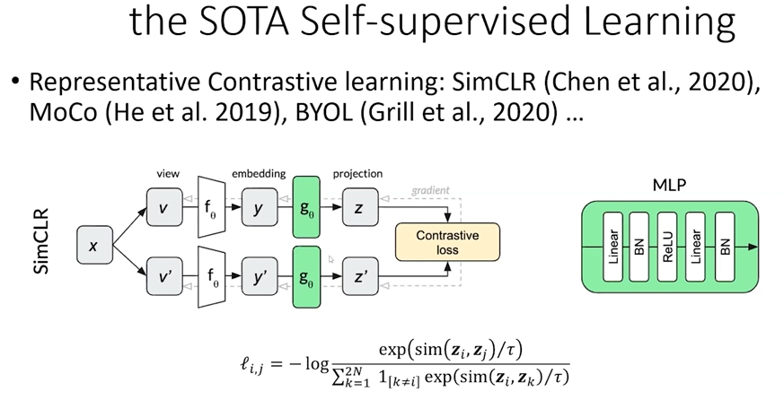
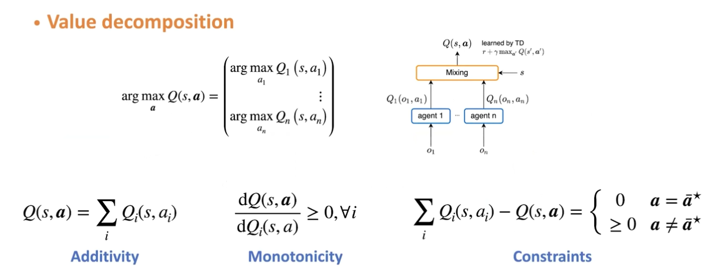

# Meeting Summary

## Tital: [大规模强化学习的未来之路]

## Agenda

1. Guest Speaker 1: [南京大学 俞扬]
    - Topic: [数据驱动的强化学习及其工业应用]
    - data driven VS simulator
    - offline VS online
    - model base VS model free
      - model free 方法通过数据学习的策略验证比较困难。
      - model base 方法对验证一个策略是容易的
    - model的构建
      - a作为输入s作为输出的有监督学习
      - $Min D_{KL}(M^*(·|s,a),M_θ(·|s,a))$
      - Hand-crafted environment problem
      - 决策数据免去人工模拟器的诸多不便
        - 专家知识
        - 成本高
        - 与现实的差距
          策略误差
          *Near-optimal reinforcement learning in polynomial time*
            Given $max_{s,a}||\hat{P}(s,a)-P(s,a)||_1 \le ε$
            For any policy π
            $||V_{\hat{M}}^π-V_{M}^π||_{\infin}\le \frac{γ}{2(1-γ)^2}ε$
            ==步长越长误差越大==
    - **Problem 1**:在模型中迭代步数被限制
*When to Trust Your Model：Model-Based Policy Optimization*

      - 解决这个限制的办法-原因是单步的误差在多步中累积

        **误差累积过程**

      - 在中间进行分布匹配（GAN）
*Error bounds of imitating policies and environments*
      $||V_{\hat{M}}^π-V_{M}^π||_{\infin}\le \frac{2√2R_{max}}{(1-γ)}√{ε_m}+\frac{2√2R_{max}}{(1-γ)^2}√{ε_π}$
      - **Explanatable is anothor advantages of model base method**

    - **Pronlem 2**:execution bais
      - 动作与状态会形成潜在的关联（基于策略采样）原因在于a,s不独立

      - 造成模型在数据上表现很好，但是策略完全错误（方程双解问题\狗头）
      - 对这个问题的讨论可以解决控制相关的众多问题 

      - 解决方案：对抗的随机分布对模型拟合进行调整
*Adversarial Counterfactual Environment Model Learning*

2. Guest Speaker 2 : [南洋理工 安波]
    - Topic: [Deep Learning for Solving Large Scale Complex Games]
*SGZero: Efficiently Learning Non-exploitable Policy in Large-Scale Network Security Games with Neural Monte Carlo Tree Search*

3. Guest Speaker 3: [天津大学 郝建业]
    - Topic: [Self-supervised Reinforcement Learning]
    - Self-supervised Learning(SSL)
    The SSL algorithm deals with unmarked data to obtiain useful representations
    **(Automatic lables generation are the key in SSL)**
    - Contrastive Learning

    For reinforcement learning, SSL can enhance the efficiency of downstream task.(eg. Planning and control)
    Via diversifying samples
    - Self-supervised Reinforcement Learning
      - States
        - *CURL-State Representation  Learning for RL*
conver

Ignore the noise
        - *DBC Bisimulation-based self-representation RL*

Ignore the noise consistently
      - Policies
        - Policy extended value function(PeVF)
        - Via embedding a not bad and distinct policy representation

      - Actions
        - The high-dimensional discrete space is reduced to a low-dimensional continuous space

      - Tasks/Environments
      - Big Models Based
    - Conclusion & Future Directions

1. Guest Speaker 4: [北京大学 卢宗青]
    - Topic: [Advance coordination Multi-agent Reinforcement Learning]
    - Problem

==**If agents are independent, the global π* can be obtained by multiplying the individual $π^*_i$ for each agent.**==

For MaxEnt RL

